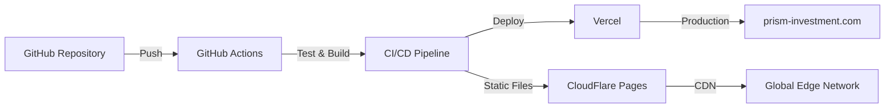

# 🚀 PRISM デプロイメントガイド

## 📋 目次
1. [システム構成概要](#システム構成概要)
2. [必要な準備](#必要な準備)
3. [初期セットアップ](#初期セットアップ)
4. [デプロイフロー](#デプロイフロー)
5. [環境別設定](#環境別設定)
6. [トラブルシューティング](#トラブルシューティング)

---

## 🏗️ システム構成概要

PRISMは以下の構成で自動デプロイを実現しています：



### 主要コンポーネント

| コンポーネント | 用途 | URL |
|------------|------|-----|
| **GitHub** | ソースコード管理 | github.com/franchette-corp/prism |
| **Vercel** | 本番環境ホスティング | prism-investment.com |
| **CloudFlare** | CDN & セキュリティ | - |
| **GitHub Actions** | CI/CD パイプライン | - |

---

## 🔧 必要な準備

### 1. アカウント作成
- [ ] GitHub アカウント
- [ ] Vercel アカウント
- [ ] CloudFlare アカウント（オプション）

### 2. 必要なツール
```bash
# Node.js (v18以上)
node --version

# npm (v9以上)
npm --version

# Vercel CLI
npm install -g vercel

# Git
git --version
```

### 3. 環境変数の準備
`.env.example` をコピーして `.env.local` を作成：
```bash
cp .env.example .env.local
```

---

## 🎯 初期セットアップ

### Step 1: リポジトリのクローン
```bash
git clone https://github.com/franchette-corp/prism-investment.git
cd prism-investment
```

### Step 2: 依存関係のインストール
```bash
npm install
```

### Step 3: Vercel プロジェクトの連携
```bash
# Vercel CLIでログイン
vercel login

# プロジェクトをVercelに連携
vercel link

# 環境変数の設定
vercel env add NEXT_PUBLIC_API_URL
vercel env add DATABASE_URL
vercel env add JWT_SECRET
# ... その他の環境変数
```

### Step 4: GitHub Secrets の設定

GitHub リポジトリの Settings → Secrets and variables → Actions で以下を設定：

| Secret名 | 説明 | 取得方法 |
|---------|------|----------|
| `VERCEL_TOKEN` | Vercel APIトークン | [Vercel Dashboard](https://vercel.com/account/tokens) |
| `VERCEL_ORG_ID` | Vercel組織ID | `vercel whoami` |
| `STAGING_API_URL` | ステージングAPI URL | 環境に応じて設定 |
| `PROD_API_URL` | 本番API URL | 環境に応じて設定 |
| `SLACK_WEBHOOK` | Slack通知用 | Slack App設定から |
| `CLOUDFLARE_API_TOKEN` | CloudFlare API | CloudFlare Dashboard |

---

## 🔄 デプロイフロー

### 自動デプロイの流れ

#### 1. 開発ブランチへのプッシュ
```bash
git checkout -b feature/new-feature
# コード変更
git add .
git commit -m "feat: 新機能の追加"
git push origin feature/new-feature
```

#### 2. プルリクエストの作成
- GitHub上でPRを作成
- 自動的にテストとビルドが実行
- レビュー後にマージ

#### 3. 環境別デプロイ

| ブランチ | 環境 | URL | 自動デプロイ |
|---------|------|-----|-------------|
| `develop` | ステージング | staging.prism-investment.vercel.app | ✅ |
| `main` | 本番 | prism-investment.com | ✅ |

### 手動デプロイ

#### Vercel CLI を使用
```bash
# ステージング環境へデプロイ
vercel --env=staging

# 本番環境へデプロイ
vercel --prod
```

#### GitHub Actions の手動実行
1. GitHub → Actions タブ
2. "PRISM Deploy Pipeline" を選択
3. "Run workflow" をクリック

---

## ⚙️ 環境別設定

### 開発環境 (Local)
```bash
# 開発サーバー起動
npm run dev

# http://localhost:3000 でアクセス
```

### ステージング環境
```javascript
// vercel.staging.json
{
  "env": {
    "NODE_ENV": "staging",
    "NEXT_PUBLIC_API_URL": "https://staging-api.prism-investment.com"
  }
}
```

### 本番環境
```javascript
// vercel.production.json
{
  "env": {
    "NODE_ENV": "production",
    "NEXT_PUBLIC_API_URL": "https://api.prism-investment.com"
  }
}
```

---

## 📊 デプロイ状況の確認

### 1. GitHub Actions
- リポジトリの "Actions" タブで確認
- 各ワークフローの実行状況を監視

### 2. Vercel Dashboard
- [vercel.com/dashboard](https://vercel.com/dashboard)
- デプロイ履歴とログを確認

### 3. 監視ツール
```bash
# Lighthouse パフォーマンスチェック
npm run lighthouse

# セキュリティ監査
npm run security:check
```

---

## 🐛 トラブルシューティング

### よくある問題と解決方法

#### 1. ビルドエラー
```bash
# キャッシュをクリア
rm -rf .next node_modules
npm install
npm run build
```

#### 2. 環境変数が反映されない
```bash
# Vercelの環境変数を再同期
vercel env pull

# ローカルで確認
npm run dev
```

#### 3. デプロイが失敗する
- GitHub Actions のログを確認
- Vercel のビルドログを確認
- 必要な環境変数が設定されているか確認

### デバッグコマンド
```bash
# 型チェック
npm run type-check

# Lintエラーチェック
npm run lint

# テスト実行
npm run test:ci
```

---

## 📝 チェックリスト

### デプロイ前の確認事項
- [ ] すべてのテストがパス
- [ ] Lintエラーがない
- [ ] 型エラーがない
- [ ] 環境変数が正しく設定されている
- [ ] package.json のバージョンを更新
- [ ] CHANGELOGを更新

### デプロイ後の確認事項
- [ ] 本番環境でアプリケーションが動作
- [ ] APIエンドポイントが正常
- [ ] 認証機能が動作
- [ ] Google Analyticsが記録されている
- [ ] エラーがSentryに送信されている

---

## 🔐 セキュリティ注意事項

1. **環境変数**
   - `.env.local` は絶対にコミットしない
   - 本番の秘密情報はGitHub Secretsで管理

2. **APIキー**
   - 定期的にローテーション
   - 最小権限の原則を適用

3. **デプロイ権限**
   - mainブランチは保護
   - PRには承認が必要

---

## 📞 サポート

問題が発生した場合：
1. [GitHub Issues](https://github.com/franchette-corp/prism/issues)
2. Slack: #prism-dev チャンネル
3. メール: dev-team@franchette.co.jp

---

## 🔄 更新履歴

| バージョン | 日付 | 内容 |
|-----------|------|------|
| 1.0.0 | 2024-01-15 | 初期リリース |
| 1.0.1 | 2024-01-20 | Vercel設定追加 |
| 1.1.0 | 2024-02-01 | CloudFlare連携 |

---

最終更新: 2024年1月15日