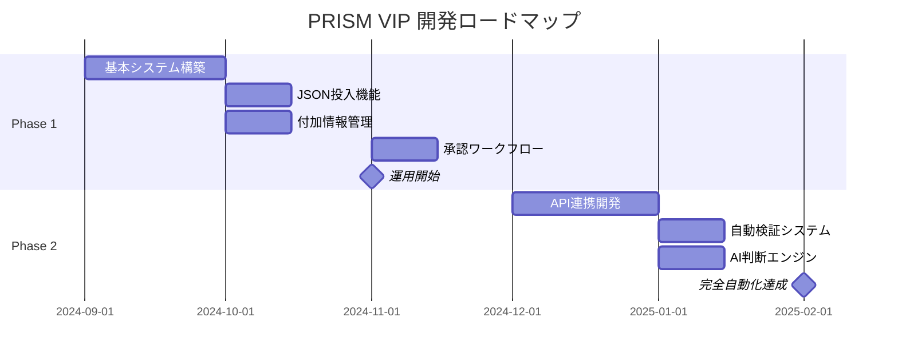
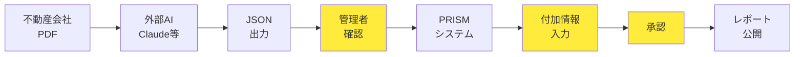
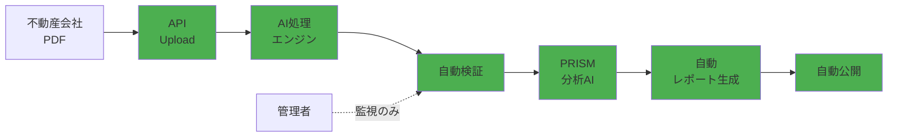

# PRISM VIP システム開発フェーズ概要

## 📊 フェーズ構成

### Phase 1: 半自動化システム（現在〜3ヶ月）
**外部AI + 手動確認による高品質レポート作成**

### Phase 2: 完全自動化システム（3ヶ月後〜）
**エンドツーエンドの自動処理による大規模運用**

## 🔄 フェーズ移行計画



## Phase 1: 半自動化システム

### 1.1 システム構成



### 1.2 特徴

| 項目 | 内容 |
|------|------|
| **処理時間** | 約11分/物件 |
| **人的介入** | 必須（データ確認、付加情報入力、承認） |
| **品質保証** | 人間による最終チェック |
| **スケール** | 〜500物件/月 |
| **コスト** | 月額6,800円 + 人件費 |

### 1.3 メリット
- ✅ 高品質なレポート保証
- ✅ 柔軟な対応が可能
- ✅ 段階的な導入でリスク最小化
- ✅ 人間の判断による付加価値

### 1.4 運用フロー

1. **PDF受領** → 営業担当が受け取り
2. **外部AI処理** → Claude等でJSON生成（3分）
3. **JSONアップロード** → 管理画面から投入
4. **データ確認** → 管理者が検証
5. **付加情報入力** → PRISM独自の分析追加
6. **承認** → 責任者による最終確認
7. **公開** → 会員向けレポート公開

## Phase 2: 完全自動化システム

### 2.1 システム構成



### 2.2 特徴

| 項目 | 内容 |
|------|------|
| **処理時間** | 約2分/物件（全自動） |
| **人的介入** | 不要（例外処理のみ） |
| **品質保証** | AI検証 + 自動テスト |
| **スケール** | 5000+物件/月 |
| **コスト** | 月額30,000円（API費用込み） |

### 2.3 新機能

#### 🤖 AI自動処理
- PDF自動取り込み（メール/API）
- マルチAI並列処理（Claude + GPT-4）
- 自動データクレンジング
- 異常値検出と自動修正

#### 📊 PRISM分析AI
- 市場データ自動取得
- 投資判断自動生成
- リスク評価AI
- 将来予測モデル

#### ⚡ リアルタイム処理
- WebSocket通知
- 処理状況リアルタイム更新
- 自動エラーリカバリー
- 24/7無人運用

### 2.4 自動化フロー

```javascript
// Phase 2: 完全自動処理フロー
async function fullyAutomatedWorkflow(pdfFile) {
  try {
    // 1. AI処理（並列実行）
    const [claudeResult, gptResult] = await Promise.all([
      processWithClaude(pdfFile),
      processWithGPT4(pdfFile)
    ]);
    
    // 2. 結果マージと検証
    const mergedData = intelligentMerge(claudeResult, gptResult);
    
    // 3. 自動データ補完
    const enrichedData = await autoEnrich(mergedData);
    
    // 4. PRISM AI分析
    const analysis = await prismAI.analyze(enrichedData);
    
    // 5. 自動レポート生成
    const report = await generateReport(enrichedData, analysis);
    
    // 6. 自動公開判定
    if (await qualityCheck(report)) {
      await autoPublish(report);
      await notifyMembers(report);
    } else {
      await escalateToHuman(report);
    }
    
    return { success: true, reportId: report.id };
    
  } catch (error) {
    await handleError(error);
    return { success: false, error };
  }
}
```

## 📈 フェーズ比較

| 指標 | Phase 1（半自動） | Phase 2（完全自動） | 改善率 |
|------|------------------|-------------------|--------|
| 処理時間 | 11分/物件 | 2分/物件 | 82%削減 |
| 人的工数 | 8分/物件 | 0.5分/物件 | 94%削減 |
| 処理能力 | 500物件/月 | 5000物件/月 | 10倍 |
| エラー率 | 5% | 1% | 80%削減 |
| 運用コスト | 27.6万円/月 | 3万円/月 | 89%削減 |

## 🚀 移行戦略

### Step 1: Phase 1運用開始（Month 1-3）
1. 基本システム稼働
2. 運用データ収集
3. 問題点の洗い出し
4. AI学習データ蓄積

### Step 2: 並行運用（Month 4-5）
1. Phase 2システム構築
2. 一部物件で自動化テスト
3. 精度検証と調整
4. フォールバック体制確立

### Step 3: Phase 2本格稼働（Month 6〜）
1. 完全自動化への切り替え
2. 監視体制の確立
3. 継続的改善
4. スケール拡大

## 💡 成功要因

### Phase 1での準備
- ✅ 高品質なデータセット構築
- ✅ エラーパターンの収集
- ✅ 業務知識の形式知化
- ✅ ユーザーフィードバック収集

### Phase 2での革新
- ✅ 最新AI技術の活用
- ✅ 継続的学習システム
- ✅ 予測的メンテナンス
- ✅ スケーラブルアーキテクチャ

## 🎯 KPI目標

### Phase 1 目標（3ヶ月後）
- 月間処理物件数: 300件
- 処理精度: 95%
- 顧客満足度: 4.0/5.0
- システム稼働率: 99%

### Phase 2 目標（6ヶ月後）
- 月間処理物件数: 2000件
- 処理精度: 99%
- 顧客満足度: 4.5/5.0
- システム稼働率: 99.9%

## 📋 リスクと対策

| リスク | Phase 1 対策 | Phase 2 対策 |
|--------|-------------|-------------|
| データ品質 | 人間による確認 | AI二重チェック |
| システム障害 | 手動バックアップ | 自動フェイルオーバー |
| 法的リスク | 承認フロー | コンプライアンスAI |
| スケール限界 | 人員増強 | クラウド自動スケール |

---
*最終更新日: 2024年9月4日*