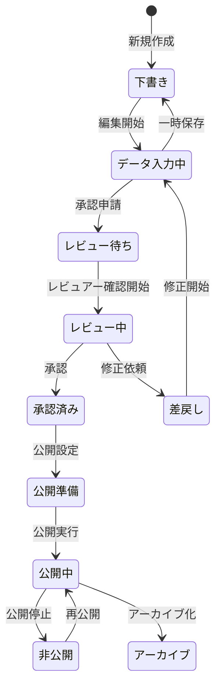

# PRISM VIP レポートプレビュー・公開ワークフロー仕様書

## 1. ワークフロー概要

### 1.1 ステータスフロー



### 1.2 権限マトリックス

| アクション | 作成者 | レビュアー | 承認者 | 管理者 |
|-----------|--------|-----------|--------|--------|
| 作成 | ✓ | - | - | ✓ |
| 編集 | ✓ | - | - | ✓ |
| 承認申請 | ✓ | - | - | ✓ |
| レビュー | - | ✓ | ✓ | ✓ |
| 承認 | - | - | ✓ | ✓ |
| 差戻し | - | ✓ | ✓ | ✓ |
| 公開 | - | - | ✓ | ✓ |
| 削除 | - | - | - | ✓ |

## 2. プレビュー機能

### 2.1 プレビューモード

#### リアルタイムプレビュー
```javascript
class RealtimePreview {
  constructor() {
    this.previewContainer = document.getElementById('preview-container');
    this.updateDebounceTimer = null;
    this.currentStage = 1;
  }

  // フォーム変更時に自動更新
  attachListeners() {
    const forms = document.querySelectorAll('.report-form');
    forms.forEach(form => {
      form.addEventListener('input', (e) => {
        this.scheduleUpdate();
      });
    });
  }

  scheduleUpdate() {
    clearTimeout(this.updateDebounceTimer);
    this.updateDebounceTimer = setTimeout(() => {
      this.updatePreview();
    }, 500); // 500ms後に更新
  }

  async updatePreview() {
    const formData = this.collectFormData();
    const html = await this.renderPreview(formData);
    this.previewContainer.innerHTML = html;
  }

  collectFormData() {
    const data = {};
    const forms = document.querySelectorAll('.report-form');
    
    forms.forEach(form => {
      const formData = new FormData(form);
      const section = form.dataset.section;
      data[section] = Object.fromEntries(formData.entries());
    });
    
    return data;
  }

  async renderPreview(data) {
    // テンプレートエンジンを使用してHTMLを生成
    const template = await this.loadTemplate();
    return this.compileTemplate(template, data);
  }
}
```

#### ステージ別プレビュー
```javascript
class StagePreview {
  constructor() {
    this.stages = [1, 2, 3, 4, 5];
    this.currentStage = 1;
  }

  // ステージ切り替え
  switchStage(stage) {
    this.currentStage = stage;
    this.updateVisibility();
    this.highlightStage(stage);
  }

  updateVisibility() {
    // 各セクションの表示/非表示を制御
    document.querySelectorAll('[data-required-stage]').forEach(element => {
      const requiredStage = parseInt(element.dataset.requiredStage);
      if (requiredStage <= this.currentStage) {
        element.classList.remove('locked');
        element.querySelector('.lock-overlay')?.remove();
      } else {
        element.classList.add('locked');
        this.addLockOverlay(element, requiredStage);
      }
    });
  }

  addLockOverlay(element, requiredStage) {
    if (!element.querySelector('.lock-overlay')) {
      const overlay = document.createElement('div');
      overlay.className = 'lock-overlay';
      overlay.innerHTML = `
        <div class="lock-message">
          <i class="icon-lock"></i>
          <p>ステージ${requiredStage}で解放されます</p>
        </div>
      `;
      element.appendChild(overlay);
    }
  }

  // ステージインジケーター更新
  highlightStage(stage) {
    document.querySelectorAll('.stage-indicator').forEach((indicator, index) => {
      if (index < stage) {
        indicator.classList.add('completed');
        indicator.classList.remove('current');
      } else if (index === stage - 1) {
        indicator.classList.add('current');
        indicator.classList.remove('completed');
      } else {
        indicator.classList.remove('completed', 'current');
      }
    });
  }
}
```

### 2.2 プレビューUI

```html
<!-- プレビューモーダル -->
<div id="previewModal" class="modal">
  <div class="modal-dialog modal-fullscreen">
    <div class="modal-content">
      <div class="modal-header">
        <h2>レポートプレビュー</h2>
        <div class="preview-controls">
          <!-- デバイス切り替え -->
          <div class="device-selector">
            <button class="active" data-device="desktop">
              <i class="icon-desktop"></i> PC
            </button>
            <button data-device="tablet">
              <i class="icon-tablet"></i> タブレット
            </button>
            <button data-device="mobile">
              <i class="icon-mobile"></i> スマホ
            </button>
          </div>
          
          <!-- ステージ切り替え -->
          <div class="stage-selector">
            <label>表示ステージ:</label>
            <select id="previewStage">
              <option value="1">ステージ1</option>
              <option value="2">ステージ2</option>
              <option value="3">ステージ3</option>
              <option value="4">ステージ4</option>
              <option value="5">ステージ5（全開放）</option>
            </select>
          </div>
          
          <button class="btn-close" onclick="closePreview()">×</button>
        </div>
      </div>
      
      <div class="modal-body">
        <div class="preview-wrapper" id="previewWrapper">
          <iframe id="previewFrame" src="about:blank"></iframe>
        </div>
      </div>
      
      <div class="modal-footer">
        <div class="preview-info">
          <span class="last-saved">最終保存: 2024/09/04 15:30</span>
          <span class="preview-url">
            プレビューURL: 
            <input type="text" readonly value="https://prism-vip.com/preview/abc123">
            <button onclick="copyUrl()">コピー</button>
          </span>
        </div>
        <div class="preview-actions">
          <button onclick="saveAndClose()">保存して閉じる</button>
          <button class="btn-primary" onclick="proceedToApproval()">承認申請へ</button>
        </div>
      </div>
    </div>
  </div>
</div>
```

### 2.3 レスポンシブプレビュー

```javascript
class ResponsivePreview {
  constructor() {
    this.devices = {
      desktop: { width: '100%', height: '100%' },
      tablet: { width: '768px', height: '1024px' },
      mobile: { width: '375px', height: '667px' }
    };
    this.currentDevice = 'desktop';
  }

  switchDevice(device) {
    this.currentDevice = device;
    const frame = document.getElementById('previewFrame');
    const wrapper = document.getElementById('previewWrapper');
    
    if (device === 'desktop') {
      wrapper.style.width = '100%';
      wrapper.style.height = '100%';
      wrapper.classList.remove('device-frame');
    } else {
      const dimensions = this.devices[device];
      wrapper.style.width = dimensions.width;
      wrapper.style.height = dimensions.height;
      wrapper.classList.add('device-frame', `device-${device}`);
    }
    
    // デバイス切り替えボタンの状態更新
    document.querySelectorAll('.device-selector button').forEach(btn => {
      btn.classList.toggle('active', btn.dataset.device === device);
    });
  }
}
```

## 3. 承認ワークフロー

### 3.1 承認申請プロセス

```javascript
class ApprovalWorkflow {
  constructor(reportId) {
    this.reportId = reportId;
    this.currentStatus = null;
  }

  // 承認申請
  async submitForApproval() {
    // 1. 完全性チェック
    const validation = await this.validateReport();
    if (!validation.isComplete) {
      this.showValidationErrors(validation.errors);
      return false;
    }

    // 2. 承認申請ダイアログ
    const approvalData = await this.showApprovalDialog();
    if (!approvalData) return false;

    // 3. 承認申請実行
    try {
      const result = await this.createApprovalRequest(approvalData);
      
      // 4. 通知送信
      await this.notifyApprovers(result.requestId);
      
      // 5. 成功メッセージ
      this.showSuccess('承認申請を送信しました');
      
      // 6. ステータス更新
      await this.updateStatus('review_requested');
      
      return true;
    } catch (error) {
      this.showError('承認申請に失敗しました: ' + error.message);
      return false;
    }
  }

  // 承認申請ダイアログ
  async showApprovalDialog() {
    return new Promise((resolve) => {
      const dialog = document.createElement('div');
      dialog.className = 'approval-dialog';
      dialog.innerHTML = `
        <h3>承認申請</h3>
        
        <div class="form-group">
          <label>承認者を選択*</label>
          <select id="approver" required>
            <option value="">選択してください</option>
            <option value="manager1">マネージャーA</option>
            <option value="manager2">マネージャーB</option>
            <option value="director">ディレクター</option>
          </select>
        </div>
        
        <div class="form-group">
          <label>申請コメント</label>
          <textarea id="comment" rows="4" 
                    placeholder="承認者へのメッセージ（任意）"></textarea>
        </div>
        
        <div class="form-group">
          <label>優先度</label>
          <select id="priority">
            <option value="normal">通常</option>
            <option value="high">高</option>
            <option value="urgent">緊急</option>
          </select>
        </div>
        
        <div class="form-group">
          <label>
            <input type="checkbox" id="notifyOnApproval">
            承認時に通知を受け取る
          </label>
        </div>
        
        <div class="dialog-actions">
          <button onclick="cancelApproval()">キャンセル</button>
          <button class="btn-primary" onclick="confirmApproval()">申請する</button>
        </div>
      `;
      
      document.body.appendChild(dialog);
      
      // イベントハンドラー設定
      window.confirmApproval = () => {
        const data = {
          approver: document.getElementById('approver').value,
          comment: document.getElementById('comment').value,
          priority: document.getElementById('priority').value,
          notifyOnApproval: document.getElementById('notifyOnApproval').checked
        };
        
        if (!data.approver) {
          alert('承認者を選択してください');
          return;
        }
        
        dialog.remove();
        resolve(data);
      };
      
      window.cancelApproval = () => {
        dialog.remove();
        resolve(null);
      };
    });
  }

  // 承認リクエスト作成
  async createApprovalRequest(data) {
    const request = {
      reportId: this.reportId,
      requesterId: getCurrentUserId(),
      approverId: data.approver,
      comment: data.comment,
      priority: data.priority,
      notifyOnApproval: data.notifyOnApproval,
      requestedAt: new Date().toISOString(),
      status: 'pending'
    };
    
    // APIコール
    const response = await fetch('/api/approval-requests', {
      method: 'POST',
      headers: {
        'Content-Type': 'application/json',
        'Authorization': `Bearer ${getAuthToken()}`
      },
      body: JSON.stringify(request)
    });
    
    return response.json();
  }
}
```

### 3.2 承認画面

```html
<!-- 承認待ちリスト -->
<div class="approval-queue">
  <h2>承認待ちレポート</h2>
  
  <div class="queue-filters">
    <select id="priorityFilter">
      <option value="">全優先度</option>
      <option value="urgent">緊急</option>
      <option value="high">高</option>
      <option value="normal">通常</option>
    </select>
    
    <select id="requesterFilter">
      <option value="">全申請者</option>
      <!-- 動的に生成 -->
    </select>
  </div>
  
  <div class="approval-list">
    <div class="approval-item urgent">
      <div class="item-header">
        <span class="priority-badge urgent">緊急</span>
        <h3>PRISM南青山プレミアムレジデンス</h3>
        <span class="request-time">10分前</span>
      </div>
      
      <div class="item-details">
        <p class="requester">申請者: 山田太郎</p>
        <p class="comment">至急確認をお願いします。明日のミーティングで使用します。</p>
      </div>
      
      <div class="item-actions">
        <button onclick="reviewReport('001')">レビュー開始</button>
        <button onclick="quickApprove('001')" class="btn-success">クイック承認</button>
        <button onclick="reject('001')" class="btn-danger">差戻し</button>
      </div>
    </div>
  </div>
</div>
```

### 3.3 レビュー機能

```javascript
class ReportReview {
  constructor(reportId) {
    this.reportId = reportId;
    this.comments = [];
    this.changeRequests = [];
  }

  // レビュー画面初期化
  async initReview() {
    // レポートデータ取得
    this.reportData = await this.loadReport();
    
    // レビューツール表示
    this.showReviewTools();
    
    // コメント機能有効化
    this.enableInlineComments();
  }

  // インラインコメント機能
  enableInlineComments() {
    document.querySelectorAll('.reviewable').forEach(element => {
      element.addEventListener('click', (e) => {
        if (e.altKey) { // Alt+クリックでコメント追加
          this.addComment(element);
        }
      });
    });
  }

  // コメント追加
  addComment(element) {
    const commentBox = document.createElement('div');
    commentBox.className = 'inline-comment';
    commentBox.innerHTML = `
      <textarea placeholder="コメントを入力..."></textarea>
      <div class="comment-actions">
        <select class="comment-type">
          <option value="suggestion">提案</option>
          <option value="issue">問題</option>
          <option value="question">質問</option>
        </select>
        <button onclick="saveComment(this)">保存</button>
        <button onclick="cancelComment(this)">キャンセル</button>
      </div>
    `;
    
    element.appendChild(commentBox);
    commentBox.querySelector('textarea').focus();
  }

  // レビュー完了
  async completeReview(decision) {
    const reviewData = {
      reportId: this.reportId,
      reviewerId: getCurrentUserId(),
      decision: decision, // 'approve', 'reject', 'request_changes'
      comments: this.comments,
      changeRequests: this.changeRequests,
      reviewedAt: new Date().toISOString()
    };

    if (decision === 'reject' || decision === 'request_changes') {
      // 差戻し理由入力
      const reason = await this.getRejectionReason();
      if (!reason) return;
      reviewData.rejectionReason = reason;
    }

    // レビュー結果送信
    await this.submitReview(reviewData);
    
    // 通知送信
    await this.notifyRequester(reviewData);
    
    // 画面遷移
    this.redirectToApprovalQueue();
  }
}
```

## 4. 公開管理

### 4.1 公開設定

```javascript
class PublishSettings {
  constructor(reportId) {
    this.reportId = reportId;
    this.settings = {
      publishDate: null,
      expiryDate: null,
      targetAudience: [],
      accessRestrictions: {},
      notifications: {}
    };
  }

  // 公開設定ダイアログ
  async showPublishDialog() {
    const dialog = `
      <div class="publish-dialog">
        <h2>公開設定</h2>
        
        <div class="form-section">
          <h3>公開日時</h3>
          <div class="form-group">
            <label>
              <input type="radio" name="publishTiming" value="now" checked>
              今すぐ公開
            </label>
            <label>
              <input type="radio" name="publishTiming" value="scheduled">
              予約公開
            </label>
          </div>
          
          <div id="scheduledSettings" style="display:none;">
            <input type="datetime-local" id="publishDate">
          </div>
        </div>
        
        <div class="form-section">
          <h3>公開対象</h3>
          <div class="form-group">
            <label>
              <input type="checkbox" value="all" checked>
              全会員
            </label>
            <label>
              <input type="checkbox" value="stage3">
              ステージ3以上
            </label>
            <label>
              <input type="checkbox" value="stage4">
              ステージ4以上
            </label>
            <label>
              <input type="checkbox" value="stage5">
              ステージ5のみ
            </label>
          </div>
        </div>
        
        <div class="form-section">
          <h3>アクセス制限</h3>
          <div class="form-group">
            <label>
              <input type="checkbox" id="requirePassword">
              パスワード保護
            </label>
            <input type="text" id="accessPassword" placeholder="パスワード" 
                   style="display:none;">
          </div>
          
          <div class="form-group">
            <label>
              <input type="checkbox" id="limitViews">
              閲覧回数制限
            </label>
            <input type="number" id="maxViews" placeholder="最大閲覧回数" 
                   style="display:none;">
          </div>
        </div>
        
        <div class="form-section">
          <h3>通知設定</h3>
          <div class="form-group">
            <label>
              <input type="checkbox" id="notifyEmail" checked>
              メール通知
            </label>
            <label>
              <input type="checkbox" id="notifyLine" checked>
              LINE通知
            </label>
            <label>
              <input type="checkbox" id="notifyInApp">
              アプリ内通知
            </label>
          </div>
        </div>
        
        <div class="dialog-actions">
          <button onclick="cancelPublish()">キャンセル</button>
          <button class="btn-primary" onclick="confirmPublish()">公開する</button>
        </div>
      </div>
    `;
    
    return this.showDialog(dialog);
  }

  // 公開実行
  async publish() {
    try {
      // 1. 最終チェック
      const finalCheck = await this.performFinalCheck();
      if (!finalCheck.passed) {
        this.showErrors(finalCheck.errors);
        return false;
      }

      // 2. 公開処理
      const publishResult = await this.executePublish();
      
      // 3. 通知送信
      if (this.settings.notifications.enabled) {
        await this.sendNotifications(publishResult);
      }

      // 4. 公開URL生成
      const publicUrl = await this.generatePublicUrl();
      
      // 5. 成功メッセージ
      this.showPublishSuccess(publicUrl);
      
      return true;
    } catch (error) {
      this.showError('公開に失敗しました: ' + error.message);
      return false;
    }
  }
}
```

### 4.2 公開後管理

```javascript
class PublishedReportManager {
  constructor() {
    this.reports = [];
  }

  // 公開レポート一覧
  async loadPublishedReports() {
    const response = await fetch('/api/reports/published');
    this.reports = await response.json();
    this.renderReportList();
  }

  // アクセス統計表示
  renderAccessStats(reportId) {
    const stats = this.getReportStats(reportId);
    
    return `
      <div class="access-stats">
        <div class="stat-item">
          <span class="stat-value">${stats.totalViews}</span>
          <span class="stat-label">総閲覧数</span>
        </div>
        <div class="stat-item">
          <span class="stat-value">${stats.uniqueViewers}</span>
          <span class="stat-label">閲覧者数</span>
        </div>
        <div class="stat-item">
          <span class="stat-value">${stats.avgTimeSpent}分</span>
          <span class="stat-label">平均滞在時間</span>
        </div>
        <div class="stat-item">
          <span class="stat-value">${stats.downloadCount}</span>
          <span class="stat-label">資料DL数</span>
        </div>
      </div>
    `;
  }

  // 公開停止
  async unpublish(reportId) {
    const confirm = await this.confirmUnpublish();
    if (!confirm) return;

    try {
      await fetch(`/api/reports/${reportId}/unpublish`, {
        method: 'POST',
        headers: {
          'Authorization': `Bearer ${getAuthToken()}`
        }
      });

      this.showSuccess('公開を停止しました');
      this.loadPublishedReports();
    } catch (error) {
      this.showError('公開停止に失敗しました');
    }
  }

  // 再公開
  async republish(reportId) {
    // 公開設定を再度表示
    const settings = new PublishSettings(reportId);
    await settings.showPublishDialog();
  }
}
```

## 5. 通知システム

### 5.1 通知テンプレート

```javascript
const notificationTemplates = {
  // 新規レポート公開通知
  newReport: {
    email: {
      subject: '【PRISM VIP】新着物件情報のお知らせ',
      body: `
        {{userName}} 様

        新しい物件情報が公開されました。

        物件名: {{propertyTitle}}
        所在地: {{location}}
        価格: {{price}}
        利回り: {{yield}}%

        詳細はこちらからご確認ください:
        {{reportUrl}}

        ※このメールは自動送信されています。
      `
    },
    line: {
      message: `新着物件情報\n\n{{propertyTitle}}\n価格: {{price}}\n利回り: {{yield}}%\n\n詳細はこちら:\n{{reportUrl}}`
    }
  },
  
  // 承認リクエスト通知
  approvalRequest: {
    email: {
      subject: '【承認依頼】物件レポートの確認をお願いします',
      body: `
        {{approverName}} 様

        以下のレポートの承認をお願いします。

        物件名: {{propertyTitle}}
        申請者: {{requesterName}}
        優先度: {{priority}}
        
        申請者コメント:
        {{comment}}

        レビュー画面:
        {{reviewUrl}}
      `
    }
  },
  
  // ステージアップ通知
  stageUpgrade: {
    email: {
      subject: '【PRISM VIP】ステージがアップグレードされました',
      body: `
        {{userName}} 様

        おめでとうございます！
        あなたのステージが {{newStage}} にアップグレードされました。

        新たに閲覧可能になった情報:
        {{unlockedContent}}

        物件詳細:
        {{propertyUrl}}
      `
    }
  }
};
```

### 5.2 通知送信機能

```javascript
class NotificationService {
  constructor() {
    this.queue = [];
    this.processing = false;
  }

  // 通知送信
  async sendNotification(type, recipient, data) {
    const notification = {
      type: type,
      recipient: recipient,
      data: data,
      channels: this.getEnabledChannels(recipient),
      createdAt: new Date().toISOString(),
      status: 'pending'
    };

    // キューに追加
    this.queue.push(notification);
    
    // 処理開始
    if (!this.processing) {
      this.processQueue();
    }
  }

  // バッチ処理
  async processQueue() {
    this.processing = true;

    while (this.queue.length > 0) {
      const batch = this.queue.splice(0, 10); // 10件ずつ処理
      
      await Promise.all(batch.map(async (notification) => {
        try {
          if (notification.channels.includes('email')) {
            await this.sendEmail(notification);
          }
          if (notification.channels.includes('line')) {
            await this.sendLine(notification);
          }
          if (notification.channels.includes('inapp')) {
            await this.sendInApp(notification);
          }
          
          notification.status = 'sent';
        } catch (error) {
          notification.status = 'failed';
          notification.error = error.message;
          console.error('通知送信エラー:', error);
        }
        
        // ログ記録
        await this.logNotification(notification);
      }));
      
      // レート制限対策
      await this.delay(1000);
    }

    this.processing = false;
  }

  // メール送信
  async sendEmail(notification) {
    const template = notificationTemplates[notification.type].email;
    const subject = this.interpolate(template.subject, notification.data);
    const body = this.interpolate(template.body, notification.data);

    await fetch('/api/notifications/email', {
      method: 'POST',
      headers: {
        'Content-Type': 'application/json',
        'Authorization': `Bearer ${getAuthToken()}`
      },
      body: JSON.stringify({
        to: notification.recipient.email,
        subject: subject,
        body: body
      })
    });
  }

  // テンプレート変数置換
  interpolate(template, data) {
    return template.replace(/\{\{(\w+)\}\}/g, (match, key) => {
      return data[key] || match;
    });
  }
}
```

## 6. 監査ログ

### 6.1 アクション記録

```javascript
class AuditLogger {
  constructor() {
    this.actions = [
      'report_created',
      'report_updated',
      'report_deleted',
      'approval_requested',
      'report_approved',
      'report_rejected',
      'report_published',
      'report_unpublished'
    ];
  }

  // アクション記録
  async logAction(action, details) {
    const log = {
      action: action,
      reportId: details.reportId,
      userId: getCurrentUserId(),
      userName: getCurrentUserName(),
      timestamp: new Date().toISOString(),
      ipAddress: await this.getClientIP(),
      userAgent: navigator.userAgent,
      details: details,
      sessionId: getSessionId()
    };

    // ログ送信
    await fetch('/api/audit-logs', {
      method: 'POST',
      headers: {
        'Content-Type': 'application/json',
        'Authorization': `Bearer ${getAuthToken()}`
      },
      body: JSON.stringify(log)
    });
  }

  // レポート履歴表示
  async getReportHistory(reportId) {
    const response = await fetch(`/api/audit-logs/report/${reportId}`);
    const logs = await response.json();
    
    return logs.map(log => ({
      action: this.getActionLabel(log.action),
      user: log.userName,
      timestamp: this.formatTimestamp(log.timestamp),
      details: log.details
    }));
  }

  getActionLabel(action) {
    const labels = {
      'report_created': 'レポート作成',
      'report_updated': 'レポート更新',
      'report_deleted': 'レポート削除',
      'approval_requested': '承認申請',
      'report_approved': '承認',
      'report_rejected': '差戻し',
      'report_published': '公開',
      'report_unpublished': '公開停止'
    };
    
    return labels[action] || action;
  }
}
```

## 7. エラー処理とリカバリー

### 7.1 自動保存機能

```javascript
class AutoSave {
  constructor() {
    this.saveInterval = 30000; // 30秒
    this.lastSaved = null;
    this.hasChanges = false;
  }

  // 自動保存開始
  start() {
    // 変更検知
    document.addEventListener('input', () => {
      this.hasChanges = true;
    });

    // 定期保存
    setInterval(() => {
      if (this.hasChanges) {
        this.save();
      }
    }, this.saveInterval);

    // ページ離脱時の警告
    window.addEventListener('beforeunload', (e) => {
      if (this.hasChanges) {
        e.preventDefault();
        e.returnValue = '未保存の変更があります。';
      }
    });
  }

  async save() {
    try {
      const data = this.collectFormData();
      
      await fetch('/api/reports/autosave', {
        method: 'POST',
        headers: {
          'Content-Type': 'application/json',
          'Authorization': `Bearer ${getAuthToken()}`
        },
        body: JSON.stringify(data)
      });

      this.lastSaved = new Date();
      this.hasChanges = false;
      this.showSaveIndicator('保存しました');
      
    } catch (error) {
      console.error('自動保存エラー:', error);
      this.showSaveIndicator('保存に失敗しました', 'error');
      
      // ローカルストレージにバックアップ
      this.saveToLocalStorage(data);
    }
  }

  // ローカルストレージバックアップ
  saveToLocalStorage(data) {
    const backup = {
      data: data,
      timestamp: new Date().toISOString()
    };
    
    localStorage.setItem(`report_backup_${data.reportId}`, JSON.stringify(backup));
  }

  // リカバリー
  async recover(reportId) {
    const backup = localStorage.getItem(`report_backup_${reportId}`);
    if (backup) {
      const { data, timestamp } = JSON.parse(backup);
      
      const confirm = await this.confirmRecover(timestamp);
      if (confirm) {
        this.restoreData(data);
        localStorage.removeItem(`report_backup_${reportId}`);
      }
    }
  }
}
```

---
*最終更新日: 2024年9月4日*