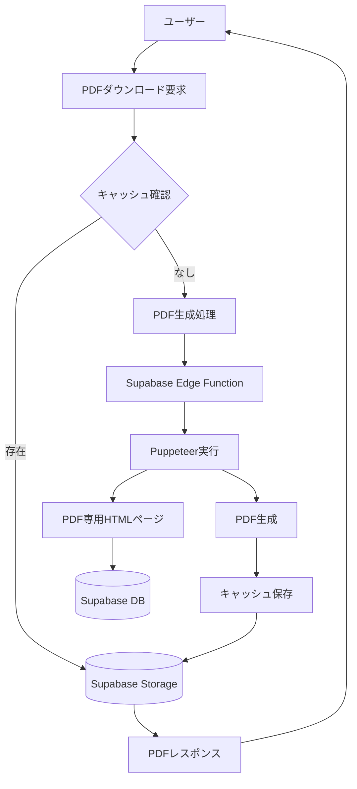

# PRISM VIP PDF生成システム設計書

## 1. システム概要

### 1.1 目的
PRISM VIPの物件投資レポートをWebページから高品質なPDFファイルとして生成し、投資家がオフラインでも詳細情報を確認できるようにする。

### 1.2 要件
- **品質**: Webページと同等の見た目を保持
- **日本語対応**: 文字化けなし、適切なフォント埋め込み
- **パフォーマンス**: 30秒以内に30ページのレポート生成
- **コスト**: 月額運用費を最小限に抑える

## 2. 技術選定

### 2.1 Puppeteerの採用理由

| 評価項目 | Puppeteer | jsPDF | React PDF | wkhtmltopdf |
|---------|-----------|-------|-----------|-------------|
| レンダリング品質 | ⭐⭐⭐⭐⭐ | ⭐⭐ | ⭐⭐⭐⭐ | ⭐⭐⭐ |
| 日本語対応 | ⭐⭐⭐⭐⭐ | ⭐⭐ | ⭐⭐⭐ | ⭐⭐⭐ |
| 実装工数 | 低 | 低 | 高 | 中 |
| 保守性 | 高 | 低 | 高 | 中 |
| 動的コンテンツ対応 | ⭐⭐⭐⭐⭐ | ⭐ | ⭐⭐⭐ | ⭐⭐ |

**決定**: Puppeteerを採用
- 既存HTMLをそのまま活用可能
- JavaScriptで生成されるチャートも完璧に再現
- Chromeと同じレンダリングエンジン

## 3. システムアーキテクチャ



## 4. 実装詳細

### 4.1 ディレクトリ構成
```
/app
  /api
    /pdf
      /generate
        route.ts          # PDF生成APIエンドポイント
  /properties
    /[id]
      /pdf-view
        page.tsx          # PDF専用レイアウトページ
        
/components
  /pdf
    PDFHeader.tsx         # PDF用ヘッダー
    PDFFooter.tsx         # PDF用フッター
    PDFTableOfContents.tsx # 目次コンポーネント
    
/lib
  /pdf
    generator.ts          # Puppeteer処理ロジック
    cache.ts             # キャッシュ管理
    templates.ts         # PDFテンプレート
    
/styles
  pdf.css                # PDF専用スタイルシート
```

### 4.2 PDF生成フロー

#### Phase 1: 基本実装（1週間）

```typescript
// /app/api/pdf/generate/route.ts
import { NextRequest, NextResponse } from 'next/server';
import { generatePDF } from '@/lib/pdf/generator';
import { getCachedPDF, cachePDF } from '@/lib/pdf/cache';

export async function GET(request: NextRequest) {
  const propertyId = request.nextUrl.searchParams.get('propertyId');
  
  if (!propertyId) {
    return NextResponse.json({ error: '物件IDが必要です' }, { status: 400 });
  }
  
  try {
    // 1. キャッシュ確認
    const cached = await getCachedPDF(propertyId);
    if (cached) {
      return new NextResponse(cached, {
        headers: {
          'Content-Type': 'application/pdf',
          'Content-Disposition': `attachment; filename="property-${propertyId}.pdf"`,
        },
      });
    }
    
    // 2. PDF生成
    const pdfBuffer = await generatePDF(propertyId);
    
    // 3. キャッシュ保存
    await cachePDF(propertyId, pdfBuffer);
    
    // 4. レスポンス返却
    return new NextResponse(pdfBuffer, {
      headers: {
        'Content-Type': 'application/pdf',
        'Content-Disposition': `attachment; filename="property-${propertyId}.pdf"`,
        'Cache-Control': 'public, max-age=3600',
      },
    });
  } catch (error) {
    console.error('PDF生成エラー:', error);
    return NextResponse.json(
      { error: 'PDF生成に失敗しました' },
      { status: 500 }
    );
  }
}
```

```typescript
// /lib/pdf/generator.ts
import puppeteer from 'puppeteer-core';
import chromium from '@sparticuz/chromium';

export async function generatePDF(propertyId: string): Promise<Buffer> {
  let browser = null;
  
  try {
    // Puppeteer起動（Vercel対応）
    browser = await puppeteer.launch({
      args: chromium.args,
      defaultViewport: chromium.defaultViewport,
      executablePath: await chromium.executablePath(),
      headless: chromium.headless,
    });
    
    const page = await browser.newPage();
    
    // PDF専用ページを開く
    const url = `${process.env.NEXT_PUBLIC_URL}/properties/${propertyId}/pdf-view`;
    await page.goto(url, {
      waitUntil: 'networkidle0',
      timeout: 30000,
    });
    
    // PDF専用CSSを注入
    await page.addStyleTag({
      content: `
        @page {
          size: A4;
          margin: 20mm 15mm;
        }
        
        @media print {
          .no-print { display: none !important; }
          .page-break { page-break-after: always; }
          
          body {
            font-size: 10.5pt;
            line-height: 1.6;
          }
          
          table {
            font-size: 9pt;
            page-break-inside: avoid;
          }
          
          h1 { font-size: 18pt; }
          h2 { font-size: 14pt; }
          h3 { font-size: 12pt; }
        }
      `,
    });
    
    // PDF生成
    const pdf = await page.pdf({
      format: 'A4',
      printBackground: true,
      displayHeaderFooter: true,
      headerTemplate: `
        <div style="width: 100%; font-size: 9px; padding: 5px 0; text-align: center;">
          <span style="color: #333;">PRISM VIP 投資レポート - 南青山プリズムビル</span>
        </div>
      `,
      footerTemplate: `
        <div style="width: 100%; font-size: 9px; padding: 5px 0; text-align: center;">
          <span class="pageNumber"></span> / <span class="totalPages"></span>
        </div>
      `,
      margin: {
        top: '25mm',
        bottom: '25mm',
        left: '15mm',
        right: '15mm',
      },
    });
    
    return Buffer.from(pdf);
    
  } finally {
    if (browser) {
      await browser.close();
    }
  }
}
```

### 4.3 PDF専用ビュー

```tsx
// /app/properties/[id]/pdf-view/page.tsx
import { Suspense } from 'react';
import { getPropertyData } from '@/lib/api/properties';
import PDFHeader from '@/components/pdf/PDFHeader';
import PDFTableOfContents from '@/components/pdf/PDFTableOfContents';

export default async function PDFView({ params }: { params: { id: string } }) {
  const property = await getPropertyData(params.id);
  
  return (
    <div className="pdf-container">
      {/* 表紙 */}
      <div className="pdf-cover page-break">
        <PDFHeader property={property} />
        <div className="cover-content">
          <h1>{property.name}</h1>
          <p className="subtitle">完全投資分析レポート</p>
          <div className="cover-info">
            <p>物件価格: {property.price}円</p>
            <p>想定利回り: {property.yield}%</p>
            <p>所在地: {property.location}</p>
          </div>
        </div>
        <div className="cover-footer">
          <p>発行日: {new Date().toLocaleDateString('ja-JP')}</p>
          <p>PRISM VIP - 機密情報</p>
        </div>
      </div>
      
      {/* 目次 */}
      <div className="pdf-toc page-break">
        <h2>目次</h2>
        <PDFTableOfContents />
      </div>
      
      {/* 1. 物件概要 */}
      <section className="pdf-section page-break">
        <h2>1. 物件概要</h2>
        <div className="property-overview-pdf">
          {/* 物件基本情報 */}
          <table className="pdf-table">
            <tbody>
              <tr>
                <th>物件名称</th>
                <td>{property.name}</td>
              </tr>
              <tr>
                <th>所在地</th>
                <td>{property.address}</td>
              </tr>
              <tr>
                <th>構造・規模</th>
                <td>{property.structure}</td>
              </tr>
              <tr>
                <th>建築年月</th>
                <td>{property.builtDate}</td>
              </tr>
            </tbody>
          </table>
        </div>
      </section>
      
      {/* 2. 収益シミュレーション */}
      <section className="pdf-section page-break">
        <h2>2. 収益シミュレーション</h2>
        <div className="simulation-pdf">
          {/* レントロール */}
          <h3>現況レントロール</h3>
          <table className="pdf-table">
            <thead>
              <tr>
                <th>階</th>
                <th>用途</th>
                <th>面積(㎡)</th>
                <th>賃料(円/月)</th>
                <th>入居状況</th>
              </tr>
            </thead>
            <tbody>
              {property.rentRoll.map((unit, index) => (
                <tr key={index}>
                  <td>{unit.floor}</td>
                  <td>{unit.usage}</td>
                  <td>{unit.area}</td>
                  <td>{unit.rent.toLocaleString()}</td>
                  <td>{unit.status}</td>
                </tr>
              ))}
            </tbody>
          </table>
        </div>
      </section>
      
      {/* 3. 融資計画（25年） */}
      <section className="pdf-section">
        <h2>3. 融資計画</h2>
        <h3>25年返済シミュレーション</h3>
        <div className="loan-simulation-pdf">
          <table className="pdf-table small">
            <thead>
              <tr>
                <th>年</th>
                <th>年間返済額</th>
                <th>元金</th>
                <th>利息</th>
                <th>残元金</th>
              </tr>
            </thead>
            <tbody>
              {/* 25年分のデータ */}
            </tbody>
          </table>
        </div>
      </section>
    </div>
  );
}
```

### 4.4 スタイルシート

```css
/* /styles/pdf.css */
.pdf-container {
  width: 210mm;
  margin: 0 auto;
  background: white;
  font-family: 'Noto Sans JP', sans-serif;
}

.page-break {
  page-break-after: always;
  min-height: 297mm;
  padding: 20mm 15mm;
  box-sizing: border-box;
}

.pdf-cover {
  display: flex;
  flex-direction: column;
  justify-content: space-between;
  text-align: center;
}

.pdf-table {
  width: 100%;
  border-collapse: collapse;
  margin: 15px 0;
}

.pdf-table th,
.pdf-table td {
  border: 1px solid #ddd;
  padding: 8px;
  text-align: left;
}

.pdf-table th {
  background-color: #f5f5f5;
  font-weight: bold;
}

.pdf-table.small {
  font-size: 8pt;
}

/* 印刷時のみ適用 */
@media print {
  .no-print {
    display: none !important;
  }
  
  body {
    margin: 0;
    padding: 0;
  }
}
```

## 5. キャッシュ戦略

### 5.1 キャッシュ管理

```typescript
// /lib/pdf/cache.ts
import { createClient } from '@supabase/supabase-js';

const supabase = createClient(
  process.env.NEXT_PUBLIC_SUPABASE_URL!,
  process.env.SUPABASE_SERVICE_KEY!
);

export async function getCachedPDF(propertyId: string): Promise<Buffer | null> {
  try {
    // 最終更新日時を確認
    const { data: property } = await supabase
      .from('properties')
      .select('updated_at')
      .eq('id', propertyId)
      .single();
    
    if (!property) return null;
    
    // キャッシュファイルの存在確認
    const fileName = `pdfs/${propertyId}_${property.updated_at}.pdf`;
    const { data } = await supabase.storage
      .from('property-pdfs')
      .download(fileName);
    
    if (data) {
      return Buffer.from(await data.arrayBuffer());
    }
    
    return null;
  } catch (error) {
    console.error('キャッシュ取得エラー:', error);
    return null;
  }
}

export async function cachePDF(propertyId: string, pdfBuffer: Buffer): Promise<void> {
  try {
    const { data: property } = await supabase
      .from('properties')
      .select('updated_at')
      .eq('id', propertyId)
      .single();
    
    if (!property) return;
    
    const fileName = `pdfs/${propertyId}_${property.updated_at}.pdf`;
    
    await supabase.storage
      .from('property-pdfs')
      .upload(fileName, pdfBuffer, {
        contentType: 'application/pdf',
        upsert: true,
      });
    
    // 古いキャッシュを削除
    await cleanOldCache(propertyId, fileName);
    
  } catch (error) {
    console.error('キャッシュ保存エラー:', error);
  }
}

async function cleanOldCache(propertyId: string, currentFile: string): Promise<void> {
  const { data: files } = await supabase.storage
    .from('property-pdfs')
    .list(`pdfs`, {
      search: propertyId,
    });
  
  if (!files) return;
  
  const filesToDelete = files
    .filter(file => file.name !== currentFile && file.name.includes(propertyId))
    .map(file => `pdfs/${file.name}`);
  
  if (filesToDelete.length > 0) {
    await supabase.storage
      .from('property-pdfs')
      .remove(filesToDelete);
  }
}
```

## 6. パフォーマンス最適化

### 6.1 並列処理

```typescript
// 複数ページの並列生成
async function generateMultiPagePDF(propertyId: string) {
  const browser = await puppeteer.launch();
  
  // 複数タブで並列処理
  const pages = await Promise.all([
    browser.newPage(), // 概要ページ
    browser.newPage(), // 収益シミュレーション
    browser.newPage(), // 融資計画
  ]);
  
  // 並列でページを読み込み
  await Promise.all([
    pages[0].goto(`${url}/overview`),
    pages[1].goto(`${url}/simulation`),
    pages[2].goto(`${url}/finance`),
  ]);
  
  // 各ページをPDF化
  const pdfs = await Promise.all(
    pages.map(page => page.pdf({ format: 'A4' }))
  );
  
  // PDFを結合（pdf-libライブラリ使用）
  const mergedPdf = await mergePDFs(pdfs);
  
  await browser.close();
  return mergedPdf;
}
```

### 6.2 メモリ管理

```typescript
// メモリリーク防止
const MAX_CONCURRENT_BROWSERS = 3;
const browserPool: puppeteer.Browser[] = [];

async function getBrowser(): Promise<puppeteer.Browser> {
  if (browserPool.length > 0) {
    return browserPool.pop()!;
  }
  
  return await puppeteer.launch({
    args: ['--no-sandbox', '--disable-setuid-sandbox'],
  });
}

async function releaseBrowser(browser: puppeteer.Browser) {
  if (browserPool.length < MAX_CONCURRENT_BROWSERS) {
    browserPool.push(browser);
  } else {
    await browser.close();
  }
}
```

## 7. エラーハンドリング

### 7.1 タイムアウト対策

```typescript
export async function generatePDFWithTimeout(propertyId: string): Promise<Buffer> {
  const TIMEOUT = 30000; // 30秒
  
  const pdfPromise = generatePDF(propertyId);
  const timeoutPromise = new Promise<never>((_, reject) => {
    setTimeout(() => reject(new Error('PDF生成タイムアウト')), TIMEOUT);
  });
  
  try {
    return await Promise.race([pdfPromise, timeoutPromise]);
  } catch (error) {
    // フォールバック: 簡易版PDF生成
    return await generateSimplePDF(propertyId);
  }
}
```

### 7.2 エラーログ

```typescript
// Supabaseにエラーログを記録
async function logPDFError(propertyId: string, error: any) {
  await supabase.from('pdf_generation_logs').insert({
    property_id: propertyId,
    error_message: error.message,
    error_stack: error.stack,
    timestamp: new Date().toISOString(),
  });
}
```

## 8. 導入スケジュール

### Phase 1: MVP実装（1週間）
- [ ] 基本的なPDF生成機能
- [ ] 物件概要ページのPDF化
- [ ] ダウンロードボタンの実装

### Phase 2: 品質向上（1週間）
- [ ] PDF専用レイアウト作成
- [ ] 25年返済計画表の完全対応
- [ ] ヘッダー・フッター・ページ番号

### Phase 3: 最適化（1週間）
- [ ] キャッシュシステム実装
- [ ] バックグラウンド生成
- [ ] エラーハンドリング強化

## 9. コスト試算

### 月間コスト（500物件/月想定）

| 項目 | 内容 | 月額 |
|-----|------|-----|
| Vercel Pro | Functionsタイムアウト延長 | $20 |
| Supabase Storage | PDF保存（50GB） | $25 |
| Puppeteer実行 | サーバーレス実行時間 | $10 |
| **合計** | - | **$55（約8,250円）** |

### コスト削減策
1. **事前生成**: 物件登録時にPDFを生成
2. **キャッシュ活用**: 同一PDFの再生成を防ぐ
3. **圧縮**: PDFサイズを最適化（pdf-lib使用）

## 10. セキュリティ考慮事項

### 10.1 アクセス制御
```typescript
// PDF生成前に認証確認
export async function GET(request: NextRequest) {
  const session = await getServerSession();
  
  if (!session) {
    return NextResponse.json({ error: '認証が必要です' }, { status: 401 });
  }
  
  // ユーザーの権限確認
  const hasAccess = await checkPropertyAccess(session.user.id, propertyId);
  if (!hasAccess) {
    return NextResponse.json({ error: 'アクセス権限がありません' }, { status: 403 });
  }
  
  // PDF生成処理...
}
```

### 10.2 透かし追加
```typescript
// PDFに透かしを追加
await page.evaluate(() => {
  const watermark = document.createElement('div');
  watermark.style.cssText = `
    position: fixed;
    top: 50%;
    left: 50%;
    transform: translate(-50%, -50%) rotate(-45deg);
    font-size: 100px;
    color: rgba(0, 0, 0, 0.1);
    z-index: 9999;
    pointer-events: none;
  `;
  watermark.textContent = 'CONFIDENTIAL';
  document.body.appendChild(watermark);
});
```

## 11. テスト戦略

### 11.1 単体テスト
```typescript
// __tests__/pdf-generator.test.ts
describe('PDF Generator', () => {
  it('should generate PDF within 30 seconds', async () => {
    const start = Date.now();
    const pdf = await generatePDF('test-property-001');
    const duration = Date.now() - start;
    
    expect(pdf).toBeInstanceOf(Buffer);
    expect(pdf.length).toBeGreaterThan(10000);
    expect(duration).toBeLessThan(30000);
  });
  
  it('should include all required sections', async () => {
    const pdf = await generatePDF('test-property-001');
    const pdfText = await extractTextFromPDF(pdf);
    
    expect(pdfText).toContain('物件概要');
    expect(pdfText).toContain('収益シミュレーション');
    expect(pdfText).toContain('25年返済計画');
  });
});
```

### 11.2 E2Eテスト
```typescript
// e2e/pdf-download.spec.ts
import { test, expect } from '@playwright/test';

test('PDFダウンロード完全フロー', async ({ page }) => {
  // ログイン
  await page.goto('/login');
  await page.fill('#email', 'test@example.com');
  await page.fill('#password', 'password');
  await page.click('button[type="submit"]');
  
  // 物件詳細ページへ
  await page.goto('/properties/001');
  
  // PDFダウンロードボタンクリック
  const [download] = await Promise.all([
    page.waitForEvent('download'),
    page.click('button:has-text("PDF版をダウンロード")'),
  ]);
  
  // ダウンロードファイルの確認
  expect(download.suggestedFilename()).toContain('.pdf');
  const path = await download.path();
  expect(path).toBeTruthy();
});
```

## 12. 監視とアラート

### 12.1 メトリクス収集
```typescript
// PDF生成のメトリクスを記録
async function recordMetrics(propertyId: string, duration: number, success: boolean) {
  await supabase.from('pdf_metrics').insert({
    property_id: propertyId,
    generation_time: duration,
    success: success,
    timestamp: new Date().toISOString(),
  });
  
  // 異常検知
  if (duration > 20000) { // 20秒以上
    await sendAlert(`PDF生成が遅延: ${propertyId} (${duration}ms)`);
  }
}
```

### 12.2 ダッシュボード表示項目
- 日次PDF生成数
- 平均生成時間
- エラー率
- キャッシュヒット率
- ストレージ使用量

## 13. 今後の拡張計画

### 短期（3ヶ月）
- [ ] 電子署名対応
- [ ] パスワード保護
- [ ] 複数言語対応（英語・中国語）

### 中期（6ヶ月）
- [ ] カスタマイズ可能なテンプレート
- [ ] インタラクティブPDF（フォーム入力）
- [ ] バッチ処理による一括生成

### 長期（1年）
- [ ] AI要約機能
- [ ] 比較レポート生成
- [ ] ブロックチェーン証明書

---
*最終更新日: 2024年12月*
*作成者: PRISM開発チーム*