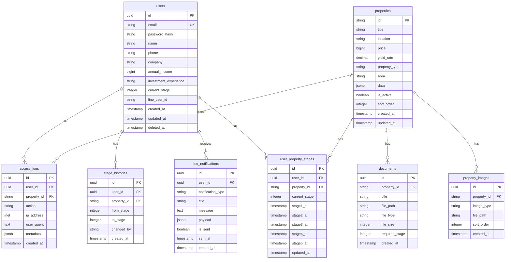

# PRISM VIP データベース設計書

## 1. データベース概要

- **データベース種類**: PostgreSQL (Supabase)
- **文字コード**: UTF-8
- **タイムゾーン**: Asia/Tokyo
- **命名規則**: snake_case
- **フェーズ対応**: 
  - Phase 1: 基本テーブル + 手動管理テーブル
  - Phase 2: 自動化テーブル + AI処理ログ

## 2. ER図



## 3. テーブル詳細

### 3.1 users (会員情報)

| カラム名 | データ型 | NULL | デフォルト | 説明 |
|---------|----------|------|-----------|------|
| id | UUID | NO | gen_random_uuid() | 主キー |
| email | VARCHAR(255) | NO | - | メールアドレス（ユニーク） |
| password_hash | VARCHAR(255) | NO | - | パスワードハッシュ |
| name | VARCHAR(100) | NO | - | 氏名 |
| phone | VARCHAR(20) | YES | - | 電話番号 |
| company | VARCHAR(200) | YES | - | 会社名 |
| annual_income | BIGINT | YES | - | 年収（暗号化保存） |
| investment_experience | VARCHAR(50) | YES | - | 投資経験 |
| current_stage | INTEGER | NO | 1 | 現在のステージ |
| line_user_id | VARCHAR(255) | YES | - | LINE連携用ID |
| created_at | TIMESTAMP | NO | NOW() | 作成日時 |
| updated_at | TIMESTAMP | NO | NOW() | 更新日時 |
| deleted_at | TIMESTAMP | YES | - | 削除日時（論理削除） |

**インデックス:**
- email (UNIQUE)
- line_user_id
- deleted_at

### 3.2 properties (物件情報)

| カラム名 | データ型 | NULL | デフォルト | 説明 |
|---------|----------|------|-----------|------|
| id | VARCHAR(10) | NO | - | 物件ID（例: "001"） |
| title | VARCHAR(200) | NO | - | 物件名 |
| location | VARCHAR(200) | YES | - | 所在地 |
| price | BIGINT | YES | - | 価格（円） |
| yield_rate | DECIMAL(5,2) | YES | - | 利回り（%） |
| property_type | VARCHAR(100) | YES | - | 物件種別 |
| area | VARCHAR(50) | YES | - | エリア |
| data | JSONB | YES | - | 詳細データ |
| is_active | BOOLEAN | NO | true | 公開フラグ |
| sort_order | INTEGER | NO | 0 | 表示順 |
| created_at | TIMESTAMP | NO | NOW() | 作成日時 |
| updated_at | TIMESTAMP | NO | NOW() | 更新日時 |

**インデックス:**
- is_active
- area
- sort_order

### 3.3 documents (資料)

| カラム名 | データ型 | NULL | デフォルト | 説明 |
|---------|----------|------|-----------|------|
| id | UUID | NO | gen_random_uuid() | 主キー |
| property_id | VARCHAR(10) | NO | - | 物件ID（外部キー） |
| title | VARCHAR(200) | NO | - | 資料名 |
| file_path | VARCHAR(500) | NO | - | ファイルパス |
| file_type | VARCHAR(50) | NO | - | ファイル種別 |
| file_size | INTEGER | YES | - | ファイルサイズ（バイト） |
| required_stage | INTEGER | NO | 1 | 必要ステージ |
| created_at | TIMESTAMP | NO | NOW() | 作成日時 |

**インデックス:**
- property_id
- required_stage

### 3.4 property_images (物件画像)

| カラム名 | データ型 | NULL | デフォルト | 説明 |
|---------|----------|------|-----------|------|
| id | UUID | NO | gen_random_uuid() | 主キー |
| property_id | VARCHAR(10) | NO | - | 物件ID（外部キー） |
| image_type | VARCHAR(50) | NO | - | 画像種別（main/exterior/interior） |
| file_path | VARCHAR(500) | NO | - | ファイルパス |
| sort_order | INTEGER | NO | 0 | 表示順 |
| created_at | TIMESTAMP | NO | NOW() | 作成日時 |

### 3.5 user_property_stages (ユーザー別物件ステージ)

| カラム名 | データ型 | NULL | デフォルト | 説明 |
|---------|----------|------|-----------|------|
| id | UUID | NO | gen_random_uuid() | 主キー |
| user_id | UUID | NO | - | ユーザーID（外部キー） |
| property_id | VARCHAR(10) | NO | - | 物件ID（外部キー） |
| current_stage | INTEGER | NO | 1 | 現在のステージ |
| stage1_at | TIMESTAMP | YES | - | ステージ1到達日時 |
| stage2_at | TIMESTAMP | YES | - | ステージ2到達日時 |
| stage3_at | TIMESTAMP | YES | - | ステージ3到達日時 |
| stage4_at | TIMESTAMP | YES | - | ステージ4到達日時 |
| stage5_at | TIMESTAMP | YES | - | ステージ5到達日時 |
| updated_at | TIMESTAMP | NO | NOW() | 更新日時 |

**インデックス:**
- user_id, property_id (UNIQUE)

### 3.6 access_logs (アクセスログ)

| カラム名 | データ型 | NULL | デフォルト | 説明 |
|---------|----------|------|-----------|------|
| id | UUID | NO | gen_random_uuid() | 主キー |
| user_id | UUID | YES | - | ユーザーID（外部キー） |
| property_id | VARCHAR(10) | YES | - | 物件ID |
| action | VARCHAR(50) | NO | - | アクション種別 |
| ip_address | INET | YES | - | IPアドレス |
| user_agent | TEXT | YES | - | ユーザーエージェント |
| metadata | JSONB | YES | - | メタデータ |
| created_at | TIMESTAMP | NO | NOW() | 作成日時 |

**インデックス:**
- user_id
- property_id
- created_at
- action

### 3.7 stage_histories (ステージ変更履歴)

| カラム名 | データ型 | NULL | デフォルト | 説明 |
|---------|----------|------|-----------|------|
| id | UUID | NO | gen_random_uuid() | 主キー |
| user_id | UUID | NO | - | ユーザーID（外部キー） |
| property_id | VARCHAR(10) | YES | - | 物件ID |
| from_stage | INTEGER | YES | - | 変更前ステージ |
| to_stage | INTEGER | NO | - | 変更後ステージ |
| changed_by | VARCHAR(100) | YES | - | 変更者 |
| created_at | TIMESTAMP | NO | NOW() | 作成日時 |

### 3.8 line_notifications (LINE通知)

| カラム名 | データ型 | NULL | デフォルト | 説明 |
|---------|----------|------|-----------|------|
| id | UUID | NO | gen_random_uuid() | 主キー |
| user_id | UUID | YES | - | ユーザーID（外部キー） |
| notification_type | VARCHAR(50) | NO | - | 通知種別 |
| title | VARCHAR(200) | NO | - | タイトル |
| message | TEXT | NO | - | メッセージ本文 |
| payload | JSONB | YES | - | 追加データ |
| is_sent | BOOLEAN | NO | false | 送信済みフラグ |
| sent_at | TIMESTAMP | YES | - | 送信日時 |
| created_at | TIMESTAMP | NO | NOW() | 作成日時 |

## 4. Phase 2 追加テーブル（完全自動化対応）

### 4.1 property_reports (物件レポート)

| カラム名 | データ型 | NULL | デフォルト | 説明 |
|---------|----------|------|-----------|------|
| id | UUID | NO | gen_random_uuid() | 主キー |
| property_id | VARCHAR(10) | NO | - | 物件ID（外部キー） |
| source_type | VARCHAR(50) | NO | - | データソース（json_upload/api/email） |
| raw_data | JSONB | NO | - | 生データ |
| processed_data | JSONB | YES | - | 処理済みデータ |
| prism_analysis | JSONB | YES | - | PRISM独自分析 |
| status | VARCHAR(50) | NO | 'draft' | ステータス |
| version | INTEGER | NO | 1 | バージョン |
| created_at | TIMESTAMP | NO | NOW() | 作成日時 |
| updated_at | TIMESTAMP | NO | NOW() | 更新日時 |
| published_at | TIMESTAMP | YES | - | 公開日時 |

### 4.2 ai_processing_logs (AI処理ログ)

| カラム名 | データ型 | NULL | デフォルト | 説明 |
|---------|----------|------|-----------|------|
| id | UUID | NO | gen_random_uuid() | 主キー |
| report_id | UUID | YES | - | レポートID（外部キー） |
| ai_service | VARCHAR(50) | NO | - | AIサービス名（claude/gpt4） |
| processing_type | VARCHAR(50) | NO | - | 処理タイプ |
| input_data | JSONB | NO | - | 入力データ |
| output_data | JSONB | YES | - | 出力データ |
| confidence_score | DECIMAL(3,2) | YES | - | 信頼度スコア |
| processing_time_ms | INTEGER | YES | - | 処理時間（ミリ秒） |
| error_message | TEXT | YES | - | エラーメッセージ |
| created_at | TIMESTAMP | NO | NOW() | 作成日時 |

### 4.3 automated_workflows (自動ワークフロー)

| カラム名 | データ型 | NULL | デフォルト | 説明 |
|---------|----------|------|-----------|------|
| id | UUID | NO | gen_random_uuid() | 主キー |
| workflow_type | VARCHAR(50) | NO | - | ワークフロータイプ |
| trigger_source | VARCHAR(100) | NO | - | トリガーソース |
| status | VARCHAR(50) | NO | 'pending' | ステータス |
| steps_completed | JSONB | YES | '[]' | 完了ステップ |
| current_step | VARCHAR(100) | YES | - | 現在のステップ |
| metadata | JSONB | YES | - | メタデータ |
| started_at | TIMESTAMP | NO | NOW() | 開始日時 |
| completed_at | TIMESTAMP | YES | - | 完了日時 |
| error_details | JSONB | YES | - | エラー詳細 |

### 4.4 api_webhooks (API/Webhook設定)

| カラム名 | データ型 | NULL | デフォルト | 説明 |
|---------|----------|------|-----------|------|
| id | UUID | NO | gen_random_uuid() | 主キー |
| name | VARCHAR(100) | NO | - | Webhook名 |
| endpoint_url | VARCHAR(500) | NO | - | エンドポイントURL |
| secret_key | VARCHAR(255) | YES | - | シークレットキー（暗号化） |
| event_types | TEXT[] | NO | - | イベントタイプ配列 |
| is_active | BOOLEAN | NO | true | 有効フラグ |
| retry_count | INTEGER | NO | 3 | リトライ回数 |
| created_at | TIMESTAMP | NO | NOW() | 作成日時 |
| last_triggered_at | TIMESTAMP | YES | - | 最終実行日時 |

### 4.5 quality_checks (品質チェック結果)

| カラム名 | データ型 | NULL | デフォルト | 説明 |
|---------|----------|------|-----------|------|
| id | UUID | NO | gen_random_uuid() | 主キー |
| report_id | UUID | NO | - | レポートID（外部キー） |
| check_type | VARCHAR(50) | NO | - | チェックタイプ |
| passed | BOOLEAN | NO | - | 合格フラグ |
| score | DECIMAL(5,2) | YES | - | スコア |
| details | JSONB | YES | - | 詳細結果 |
| checked_at | TIMESTAMP | NO | NOW() | チェック日時 |

## 5. Row Level Security (RLS) ポリシー

### 5.1 users テーブル
```sql
-- 自分の情報のみ参照可能
CREATE POLICY "Users can view own data" ON users
    FOR SELECT USING (auth.uid() = id);

-- 自分の情報のみ更新可能
CREATE POLICY "Users can update own data" ON users
    FOR UPDATE USING (auth.uid() = id);
```

### 5.2 properties テーブル
```sql
-- アクティブな物件のみ参照可能
CREATE POLICY "View active properties" ON properties
    FOR SELECT USING (is_active = true);
```

### 5.3 documents テーブル
```sql
-- ユーザーのステージに応じて参照可能
CREATE POLICY "View documents by stage" ON documents
    FOR SELECT USING (
        required_stage <= (
            SELECT current_stage FROM users WHERE id = auth.uid()
        )
    );
```

## 6. トリガーとファンクション

### 6.1 updated_at 自動更新
```sql
CREATE OR REPLACE FUNCTION update_updated_at()
RETURNS TRIGGER AS $$
BEGIN
    NEW.updated_at = NOW();
    RETURN NEW;
END;
$$ LANGUAGE plpgsql;

-- 各テーブルにトリガーを設定
CREATE TRIGGER update_users_updated_at
    BEFORE UPDATE ON users
    FOR EACH ROW
    EXECUTE FUNCTION update_updated_at();
```

### 6.2 ステージ変更履歴記録
```sql
CREATE OR REPLACE FUNCTION record_stage_change()
RETURNS TRIGGER AS $$
BEGIN
    IF NEW.current_stage != OLD.current_stage THEN
        INSERT INTO stage_histories (
            user_id, from_stage, to_stage, changed_by
        ) VALUES (
            NEW.id, OLD.current_stage, NEW.current_stage, 'system'
        );
    END IF;
    RETURN NEW;
END;
$$ LANGUAGE plpgsql;
```

## 7. Phase 2 追加機能

### 7.1 自動化トリガー

```sql
-- PDFアップロード時の自動処理開始
CREATE OR REPLACE FUNCTION trigger_auto_processing()
RETURNS TRIGGER AS $$
BEGIN
    -- ワークフロー開始
    INSERT INTO automated_workflows (
        workflow_type, 
        trigger_source,
        metadata
    ) VALUES (
        'pdf_processing',
        NEW.source_type,
        jsonb_build_object('report_id', NEW.id)
    );
    
    -- AI処理キューに追加
    PERFORM pg_notify('ai_processing_queue', NEW.id::text);
    
    RETURN NEW;
END;
$$ LANGUAGE plpgsql;
```

### 7.2 品質チェック自動化

```sql
-- 自動品質チェック関数
CREATE OR REPLACE FUNCTION auto_quality_check(report_id UUID)
RETURNS BOOLEAN AS $$
DECLARE
    check_passed BOOLEAN := true;
    report_data JSONB;
BEGIN
    SELECT processed_data INTO report_data
    FROM property_reports
    WHERE id = report_id;
    
    -- 必須フィールドチェック
    IF report_data->>'propertyName' IS NULL OR
       report_data->>'price' IS NULL OR
       report_data->>'location' IS NULL THEN
        check_passed := false;
    END IF;
    
    -- 結果記録
    INSERT INTO quality_checks (
        report_id, check_type, passed, score
    ) VALUES (
        report_id, 'completeness', check_passed, 
        CASE WHEN check_passed THEN 100 ELSE 0 END
    );
    
    RETURN check_passed;
END;
$$ LANGUAGE plpgsql;
```

## 8. インデックス戦略

### 6.1 パフォーマンス最適化
- 頻繁に検索されるカラムにインデックス設定
- 複合インデックスの活用
- 部分インデックスで効率化

### 6.2 主要インデックス
```sql
-- ユーザー検索用
CREATE INDEX idx_users_email ON users(email) WHERE deleted_at IS NULL;

-- 物件一覧表示用
CREATE INDEX idx_properties_active_sort ON properties(sort_order) 
    WHERE is_active = true;

-- アクセスログ分析用
CREATE INDEX idx_access_logs_user_date ON access_logs(user_id, created_at DESC);
```

## 7. バックアップとリカバリ

### 7.1 バックアップ戦略
- **自動バックアップ**: 日次（Supabase標準機能）
- **保持期間**: 30日間
- **Point-in-Time Recovery**: 最大7日前まで

### 7.2 リカバリ手順
1. Supabase管理画面からバックアップ選択
2. リストアポイント選択
3. リストア実行
4. データ整合性確認

## 8. マイグレーション管理

### 8.1 マイグレーションファイル命名規則
```
YYYYMMDD_HHMMSS_description.sql
例: 20240904_120000_create_users_table.sql
```

### 8.2 マイグレーション実行
```bash
# Supabase CLIを使用
supabase db push
supabase db reset
```

---
*最終更新日: 2024年9月4日*