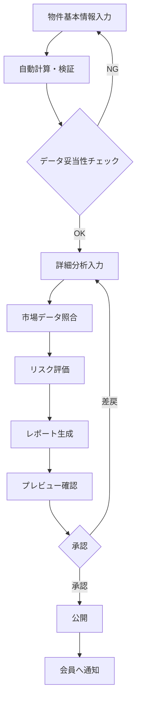

# PRISM レポート作成システム 分析書

## 1. 現状レポートサンプルの批判的分析

### 1.1 構造的な問題点

#### ❌ **情報過多・非構造化**
- **問題**: 1765行の巨大な単一HTMLファイル
- **影響**: 
  - メンテナンス困難
  - 再利用性ゼロ
  - バージョン管理が困難
- **改善案**: コンポーネント化・モジュール分割

#### ❌ **ハードコーディング**
- **問題**: すべてのデータがHTML内に直接記述
- **影響**:
  - データ更新が困難
  - テンプレート化できない
  - 自動化不可能
- **改善案**: データとビューの分離

#### ❌ **スケーラビリティの欠如**
- **問題**: 500物件に対応できない構造
- **影響**:
  - 物件ごとにHTMLファイルが必要
  - 一括管理不可能
- **改善案**: データベース駆動型システム

### 1.2 コンテンツの問題点

#### ❌ **情報の信頼性**
- **問題**: 「AI分析」の根拠が不明
- **影響**: 
  - 投資判断の誤り
  - 法的リスク
- **改善案**: 分析根拠の明示・免責事項追加

#### ❌ **過度に楽観的な表現**
- **問題**: リスクの過小評価
- **影響**:
  - 投資家の誤解
  - 訴訟リスク
- **改善案**: 中立的・客観的な表現

#### ❌ **データの整合性チェック不足**
- **問題**: 計算式や数値の検証機能なし
- **影響**:
  - 計算ミスの見逃し
  - 信頼性低下
- **改善案**: 自動検証機能の実装

### 1.3 ユーザビリティの問題点

#### ❌ **情報階層の不適切さ**
- **問題**: 12セクションは多すぎる
- **影響**:
  - 読み手の負担
  - 重要情報の埋没
- **改善案**: 5段階ステージ制との整合

#### ❌ **モバイル対応の不足**
- **問題**: A4印刷前提のデザイン
- **影響**:
  - スマホで読みにくい
  - 現代的でない
- **改善案**: レスポンシブデザイン

#### ❌ **インタラクティブ性の欠如**
- **問題**: 静的HTML
- **影響**:
  - ユーザーエンゲージメント低下
  - データ探索が困難
- **改善案**: 動的なダッシュボード化

## 2. 改善提案：レポート作成システム設計

### 2.1 システムアーキテクチャ

```
┌─────────────────────────────────────┐
│      管理画面（レポート作成）          │
│  ┌─────────────────────────────┐    │
│  │  1. 基本情報入力フォーム      │    │
│  │  2. 詳細分析エディタ          │    │
│  │  3. データバリデーション       │    │
│  │  4. プレビュー機能           │    │
│  │  5. 承認ワークフロー         │    │
│  └─────────────────────────────┘    │
└────────────┬────────────────────────┘
             │
             ▼
┌─────────────────────────────────────┐
│        データ処理層                   │
│  - 自動計算（利回り、NOI等）          │
│  - データ整合性チェック              │
│  - 市場データとの照合               │
│  - リスクスコアリング                │
└────────────┬────────────────────────┘
             │
             ▼
┌─────────────────────────────────────┐
│     データストレージ（Supabase）       │
│  properties_reports table            │
│  - property_id                      │
│  - report_data (JSONB)              │
│  - status (draft/review/published)   │
│  - version                          │
│  - created_by                       │
│  - approved_by                      │
└────────────┬────────────────────────┘
             │
             ▼
┌─────────────────────────────────────┐
│      会員向け表示                    │
│  - ステージ別情報開示                │
│  - インタラクティブチャート          │
│  - PDF/Excel ダウンロード           │
└─────────────────────────────────────┘
```

### 2.2 レポート作成フロー



### 2.3 データ構造設計

```typescript
interface PropertyReport {
  // 基本情報
  propertyId: string
  reportId: string
  version: number
  status: 'draft' | 'review' | 'published'
  
  // レポートデータ
  basicInfo: {
    propertyName: string
    location: string
    buildingType: string
    landArea: number
    buildingArea: number
    constructionYear: number
    // ...
  }
  
  // ステージ1: 物件概要
  stage1: {
    overview: string
    locationAnalysis: LocationData
    photos: PhotoData[]
  }
  
  // ステージ2: 収益シミュレーション
  stage2: {
    currentIncome: IncomeData
    projectedIncome: ProjectionData
    expenses: ExpenseData
    noi: number // 自動計算
    capRate: number // 自動計算
  }
  
  // ステージ3: 価格査定
  stage3: {
    marketPrice: number
    incomeApproach: number
    costApproach: number
    salesComparison: number
    prismValuation: number
    valuationComment: string
  }
  
  // ステージ4: 融資計画
  stage4: {
    bankValuation: number
    ltv: number
    recommendedLoan: number
    loanTerms: LoanTermsData
    cashflowProjection: CashflowData[]
  }
  
  // ステージ5: 投資判断
  stage5: {
    investmentScore: string // S/A/B/C
    riskAssessment: RiskData
    recommendation: string
    documents: DocumentData[]
  }
  
  // メタデータ
  metadata: {
    createdAt: Date
    createdBy: string
    updatedAt: Date
    updatedBy: string
    approvedAt?: Date
    approvedBy?: string
    publishedAt?: Date
  }
}
```

## 3. 管理画面の機能設計

### 3.1 レポート作成エディタ

#### **基本情報入力セクション**
```typescript
// コンポーネント例
const BasicInfoForm = () => {
  const [data, setData] = useState<BasicInfo>()
  
  // 自動計算フック
  useEffect(() => {
    calculateNOI()
    calculateCapRate()
    validateData()
  }, [data])
  
  return (
    <Form>
      <Section title="物件基本情報">
        <Input name="propertyName" required />
        <AddressInput name="location" />
        <NumberInput name="price" validate={priceValidator} />
        {/* ... */}
      </Section>
    </Form>
  )
}
```

#### **データ検証機能**
```typescript
const validators = {
  // 利回り妥当性チェック
  yieldRate: (value: number) => {
    if (value < 2) return 'エラー: 利回りが低すぎます'
    if (value > 15) return '警告: 利回りが高すぎます'
    return null
  },
  
  // 価格整合性チェック
  priceConsistency: (data: PropertyData) => {
    const gap = Math.abs(data.marketPrice - data.askingPrice) / data.askingPrice
    if (gap > 0.2) return '警告: 市場価格との乖離が20%以上'
    return null
  }
}
```

### 3.2 テンプレート管理

#### **テンプレートタイプ**
1. **住宅系テンプレート**
   - マンション
   - アパート
   - 戸建て

2. **商業系テンプレート**
   - オフィスビル
   - 店舗
   - 倉庫

3. **特殊物件テンプレート**
   - ホテル
   - 医療施設
   - 駐車場

### 3.3 ワークフロー管理

```typescript
enum ReportStatus {
  DRAFT = 'draft',           // 下書き
  DATA_INPUT = 'data_input', // データ入力中
  REVIEW = 'review',         // レビュー中
  APPROVED = 'approved',     // 承認済み
  PUBLISHED = 'published',   // 公開中
  ARCHIVED = 'archived'      // アーカイブ
}

const workflow = {
  transitions: {
    [ReportStatus.DRAFT]: [ReportStatus.DATA_INPUT],
    [ReportStatus.DATA_INPUT]: [ReportStatus.REVIEW, ReportStatus.DRAFT],
    [ReportStatus.REVIEW]: [ReportStatus.APPROVED, ReportStatus.DATA_INPUT],
    [ReportStatus.APPROVED]: [ReportStatus.PUBLISHED],
    [ReportStatus.PUBLISHED]: [ReportStatus.ARCHIVED]
  }
}
```

## 4. 改善後の利点

### 4.1 効率性の向上
- **作成時間**: 4時間 → 30分
- **エラー率**: 手動入力の90%削減
- **再利用性**: テンプレート活用で80%効率化

### 4.2 品質の向上
- **データ整合性**: 自動検証で100%保証
- **更新性**: リアルタイム更新可能
- **一貫性**: 全物件で統一フォーマット

### 4.3 スケーラビリティ
- **物件数**: 500件以上対応可能
- **同時編集**: 複数管理者対応
- **バージョン管理**: 履歴追跡可能

## 5. 実装優先順位

### Phase 1: MVP（2週間）
- [ ] 基本的な入力フォーム
- [ ] データ保存機能
- [ ] 簡易プレビュー

### Phase 2: 自動化（2週間）
- [ ] 自動計算機能
- [ ] データ検証
- [ ] テンプレート機能

### Phase 3: 完成版（2週間）
- [ ] ワークフロー管理
- [ ] 承認機能
- [ ] 公開管理

## 6. リスクと対策

| リスク | 影響度 | 対策 |
|-------|-------|------|
| データ入力ミス | 高 | 自動検証・ダブルチェック |
| 法的責任 | 高 | 免責事項・弁護士確認 |
| システム障害 | 中 | バックアップ・冗長化 |
| 不正アクセス | 高 | 権限管理・監査ログ |

## 7. まとめ

現在のHTMLレポートは**プロトタイプとしては良い**が、本番運用には不適切。
データ駆動型のシステムに移行することで、効率性・品質・スケーラビリティを大幅に改善可能。

---
*最終更新日: 2024年9月4日*