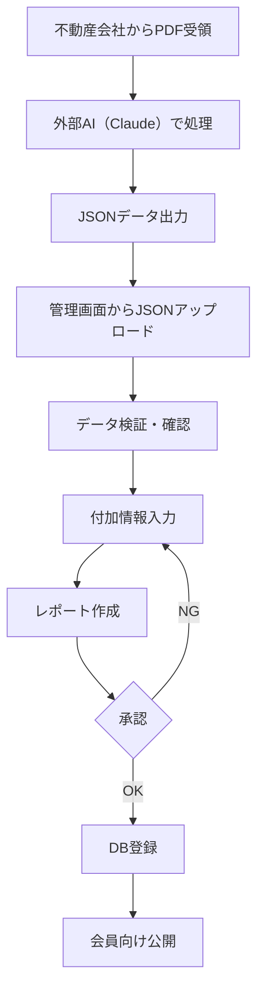

# PRISM VIP JSON データ投入・レポート作成システム仕様書

## 1. システム概要

外部AI（Claude等）で正規化されたJSON形式の物件データを管理画面から投入し、付加情報を追加して会員向けレポートを完成させるシステム。

### 1.1 処理フロー



### 1.2 外部AI処理からのJSON形式

外部AI（Claude等）から出力される標準JSONフォーマット：

```json
{
  "propertyId": "PRISM-2024-001",
  "basicInfo": {
    "propertyName": "物件名",
    "location": {
      "prefecture": "都道府県",
      "city": "市区町村",
      "address": "詳細住所"
    },
    "price": 680000000,
    "landArea": 500.5,
    "buildingArea": 1200.3,
    "buildingAge": 10,
    "propertyType": "マンション"
  },
  "incomeInfo": {
    "monthlyRent": 3600000,
    "annualIncome": 43200000,
    "occupancyRate": 95.5
  },
  "extractionMetadata": {
    "sourceFiles": ["物件概要書.pdf", "レントロール.pdf"],
    "extractedAt": "2024-09-04T10:00:00Z",
    "aiModel": "claude-3",
    "confidence": 0.92
  }
}
```

## 2. JSONアップロード・検証システム

### 2.1 技術スタック

```typescript
// PRISMシステム側の技術スタック
const techStack = {
  jsonProcessing: {
    validation: 'Zod',           // JSONスキーマ検証
    parser: 'JSON.parse',        // 標準JSONパーサー
    formatter: 'prettier',       // JSON整形
  },
  dataEnhancement: {
    calculation: 'Custom functions',  // 利回り計算等
    validation: 'Business rules',     // ビジネスルール検証
    enrichment: 'Internal APIs',      // データ付加
  },
  storage: {
    database: 'Supabase',        // PostgreSQL
    fileStorage: 'Supabase Storage', // ファイルストレージ
  }
};
```

### 2.2 JSONアップロードパイプライン

```javascript
class JSONUploadProcessor {
  constructor() {
    this.validator = new DataValidator();
    this.enricher = new DataEnricher();
    this.calculator = new FinancialCalculator();
  }

  // メイン処理フロー
  async processJSON(jsonData, uploadMetadata) {
    try {
      // 1. JSON形式検証
      const parsed = await this.parseAndValidateJSON(jsonData);
      
      // 2. スキーマ検証
      const validated = await this.validateSchema(parsed);
      
      // 3. ビジネスルール検証
      const businessValidation = await this.validateBusinessRules(validated);
      
      // 4. 自動計算フィールド追加
      const calculated = await this.addCalculatedFields(validated);
      
      // 5. データエンリッチメント（付加情報）
      const enriched = await this.enrichData(calculated);
      
      return {
        success: true,
        data: enriched,
        validation: businessValidation,
        requiresAdditionalInput: this.checkRequiredFields(enriched)
      };
      
    } catch (error) {
      return {
        success: false,
        error: error.message,
        errorType: this.classifyError(error)
      };
    }
  }

  // JSONデータ検証とエンリッチメント
  async parseAndValidateJSON(jsonString) {
    try {
      const data = JSON.parse(jsonString);
      return data;
    } catch (error) {
      throw new Error('無効なJSON形式です: ' + error.message);
    }
  }

  // 必須フィールドチェック
  checkRequiredFields(data) {
    const required = [
      'propertyName',
      'location.prefecture', 
      'price',
      'annualIncome'
    ];
    
    const missing = [];
    required.forEach(field => {
      if (!this.getNestedValue(data, field)) {
        missing.push(field);
      }
    });
    
    return missing;
  }

  // 自動計算フィールド追加
  async addCalculatedFields(data) {
    // 利回り計算
    if (data.basicInfo?.price && data.incomeInfo?.annualIncome) {
      data.calculatedFields = {
        grossYield: (data.incomeInfo.annualIncome / data.basicInfo.price * 100).toFixed(2),
        monthlyIncome: data.incomeInfo.annualIncome / 12,
        pricePerSqm: data.basicInfo.price / data.basicInfo.buildingArea
      };
    }
    
    return data;
  }
}
```

## 3. 管理画面でのJSONアップロード機能

### 3.1 JSONアップロードインターフェース

```html
<div class="json-upload-container">
  <h2>物件データJSONアップロード</h2>
  
  <!-- ステップ1: JSONアップロード -->
  <div class="upload-step">
    <h3>ステップ1: 外部AIで生成したJSONをアップロード</h3>
    <div class="upload-area">
      <div class="json-input-tabs">
        <button class="tab active" data-tab="paste">貼り付け</button>
        <button class="tab" data-tab="file">ファイル選択</button>
      </div>
      
      <!-- 貼り付けタブ -->
      <div class="tab-content" id="paste-tab">
        <textarea 
          id="jsonInput" 
          placeholder="Claude等で生成したJSONデータを貼り付けてください"
          rows="15">
        </textarea>
        <button onclick="validateJSON()">JSONを検証</button>
      </div>
      
      <!-- ファイル選択タブ -->
      <div class="tab-content hidden" id="file-tab">
        <input type="file" accept=".json" onchange="loadJSONFile(event)">
        <div class="file-info"></div>
      </div>
    </div>
    
    <!-- 検証結果表示 -->
    <div class="validation-result" id="validationResult">
      <!-- 動的に生成 -->
    </div>
  </div>

  <!-- ステップ2: データ確認・修正 -->
  <div class="upload-step">
    <h3>ステップ2: アップロードデータの確認</h3>
    <div class="data-review" id="dataReview">
      <!-- 動的に生成される確認フォーム -->
    </div>
  </div>
  
  <!-- ステップ3: 付加情報入力 -->
  <div class="upload-step">
    <h3>ステップ3: 付加情報の入力</h3>
    <form id="additionalInfoForm">
      <div class="form-section">
        <h4>投資分析情報</h4>
        <div class="form-group">
          <label>PRISM査定価格</label>
          <input type="number" name="prismValuation" required>
          <span class="helper">AIデータの価格を参考に査定価格を入力</span>
        </div>
        
        <div class="form-group">
          <label>投資推奨度</label>
          <select name="investmentGrade" required>
            <option value="S">S - 特に推奨</option>
            <option value="A">A - 推奨</option>
            <option value="B">B - 条件付き推奨</option>
            <option value="C">C - 要検討</option>
          </select>
        </div>
        
        <div class="form-group">
          <label>推奨理由・コメント</label>
          <textarea name="recommendation" rows="5" required
                    placeholder="投資判断の根拠、リスク、将来性など"></textarea>
        </div>
      </div>
      
      <div class="form-section">
        <h4>追加資料</h4>
        <div class="document-upload">
          <button type="button" onclick="addDocument()">+ 資料追加</button>
          <div id="documentList">
            <!-- 動的に追加 -->
          </div>
        </div>
      </div>
    </form>
  </div>
</div>

```javascript
// JSONアップロード処理
class JSONUploadHandler {
  constructor() {
    this.uploadedData = null;
    this.validationErrors = [];
  }

  // JSON検証
  async validateJSON() {
    const input = document.getElementById('jsonInput').value;
    
    try {
      const data = JSON.parse(input);
      this.uploadedData = data;
      
      // スキーマ検証
      const validation = await this.validateSchema(data);
      
      if (validation.valid) {
        this.showSuccess('JSON形式が正しいです');
        this.displayDataReview(data);
        this.enableNextStep();
      } else {
        this.showErrors(validation.errors);
      }
    } catch (error) {
      this.showError('無効なJSON形式です: ' + error.message);
    }
  }
  
  // データレビュー表示
  displayDataReview(data) {
    const reviewContainer = document.getElementById('dataReview');
    reviewContainer.innerHTML = this.generateReviewHTML(data);
  }
  
  // 付加情報とマージ
  async mergeWithAdditionalInfo() {
    const additionalData = this.collectAdditionalInfo();
    
    const mergedData = {
      ...this.uploadedData,
      prismAnalysis: additionalData,
      metadata: {
        uploadedAt: new Date().toISOString(),
        uploadedBy: getCurrentUser(),
        dataSource: 'external_ai'
      }
    };
    
    return mergedData;
  }
}
```
```

### 3.2 付加情報入力フォーム

```javascript
// 付加情報管理
class AdditionalInfoManager {
  constructor() {
    this.requiredFields = [
      'prismValuation',
      'investmentGrade',
      'recommendation',
      'riskAssessment',
      'marketAnalysis'
    ];
  }

  // 付加情報フォーム生成
  generateAdditionalInfoForm(baseData) {
    // AIデータを基にフォームの初期値を設定
    const suggestedValues = this.generateSuggestions(baseData);
    
    return `
      <form id="additionalInfoForm">
        <div class="form-section">
          <h4>PRISM独自分析</h4>
          
          <div class="form-group">
            <label>PRISM査定価格*</label>
            <input type="number" name="prismValuation" 
                   value="${suggestedValues.valuation}" required>
            <span class="suggestion">AI提案: ${formatCurrency(suggestedValues.valuation)}</span>
          </div>
          
          <div class="form-group">
            <label>投資推奨度*</label>
            <select name="investmentGrade" required>
              <option value="S" ${suggestedValues.grade === 'S' ? 'selected' : ''}>S - 特に推奨</option>
              <option value="A" ${suggestedValues.grade === 'A' ? 'selected' : ''}>A - 推奨</option>
              <option value="B" ${suggestedValues.grade === 'B' ? 'selected' : ''}>B - 条件付き</option>
              <option value="C" ${suggestedValues.grade === 'C' ? 'selected' : ''}>C - 要検討</option>
            </select>
          </div>
          
          <div class="form-group">
            <label>マーケット分析*</label>
            <textarea name="marketAnalysis" rows="4" required>${suggestedValues.marketAnalysis}</textarea>
          </div>
          
          <div class="form-group">
            <label>リスク評価*</label>
            <div class="risk-matrix">
              ${this.generateRiskMatrix(baseData)}
            </div>
          </div>
          
          <div class="form-group">
            <label>推奨理由*</label>
            <textarea name="recommendation" rows="5" required>${suggestedValues.recommendation}</textarea>
          </div>
        </div>
      </form>
    `;
  }
  
  // AIデータから提案値を生成
  generateSuggestions(data) {
    const suggestions = {};
    
    // 査定価格提案
    if (data.basicInfo?.price) {
      suggestions.valuation = Math.round(data.basicInfo.price * 1.05); // 5%上乗せ例
    }
    
    // 投資グレード判定
    const yield = data.incomeInfo?.annualIncome / data.basicInfo?.price * 100;
    if (yield >= 6) suggestions.grade = 'S';
    else if (yield >= 5) suggestions.grade = 'A';
    else if (yield >= 4) suggestions.grade = 'B';
    else suggestions.grade = 'C';
    
    return suggestions;
  }
}
```

### 3.3 レポート生成ワークフロー

```javascript
// 完全なレポート生成フロー
class ReportGenerationWorkflow {
  constructor() {
    this.steps = [
      'json_upload',      // JSONアップロード
      'validation',       // 検証
      'additional_info',  // 付加情報入力
      'preview',         // プレビュー
      'approval',        // 承認
      'publish'          // 公開
    ];
    this.currentStep = 0;
  }

  // ワークフロー実行
  async executeWorkflow(jsonData) {
    try {
      // Step 1: JSONデータアップロードと検証
      const validated = await this.validateJSONData(jsonData);
      if (!validated.success) {
        return { error: 'データ検証エラー', details: validated.errors };
      }
      
      // Step 2: 付加情報の入力促進
      const additionalInfo = await this.promptAdditionalInfo(validated.data);
      
      // Step 3: 完全なレポートデータ生成
      const reportData = await this.generateCompleteReport({
        ...validated.data,
        ...additionalInfo
      });
      
      // Step 4: プレビュー生成
      const preview = await this.generatePreview(reportData);
      
      // Step 5: 承認フロー
      const approved = await this.requestApproval(reportData, preview);
      
      if (approved) {
        // Step 6: DB保存と公開
        const published = await this.publishReport(reportData);
        return { success: true, reportId: published.id };
      }
      
    } catch (error) {
      console.error('ワークフローエラー:', error);
      return { error: error.message };
    }
  }

  // 完全なレポートデータ構造
  generateCompleteReport(data) {
    return {
      // 外部AIからのデータ
      basicInfo: data.basicInfo,
      incomeInfo: data.incomeInfo,
      
      // PRISMで追加したデータ
      prismAnalysis: {
        valuation: data.prismValuation,
        investmentGrade: data.investmentGrade,
        recommendation: data.recommendation,
        riskAssessment: data.riskAssessment,
        marketAnalysis: data.marketAnalysis
      },
      
      // 自動計算フィールド
      calculations: {
        grossYield: this.calculateGrossYield(data),
        netYield: this.calculateNetYield(data),
        noi: this.calculateNOI(data),
        cashflow: this.calculateCashflow(data)
      },
      
      // メタデータ
      metadata: {
        createdAt: new Date().toISOString(),
        createdBy: getCurrentUser(),
        dataSource: 'external_ai_with_manual_enhancement',
        version: 1
      }
    };
  }
}
```

## 4. 統合管理画面

### 4.1 JSON投入から公開までの統合UI

```html
<div class="integrated-report-workflow">
  <div class="workflow-header">
    <h2>物件レポート作成ワークフロー</h2>
    <div class="workflow-progress">
      <div class="step completed">
        <span class="step-number">1</span>
        <span class="step-name">JSONアップロード</span>
      </div>
      <div class="step active">
        <span class="step-number">2</span>
        <span class="step-name">データ確認</span>
      </div>
      <div class="step">
        <span class="step-number">3</span>
        <span class="step-name">付加情報</span>
      </div>
      <div class="step">
        <span class="step-number">4</span>
        <span class="step-name">プレビュー</span>
      </div>
      <div class="step">
        <span class="step-number">5</span>
        <span class="step-name">公開</span>
      </div>
    </div>
  </div>

  <div class="workflow-body">
    <!-- JSONデータ表示パネル -->
    <div class="data-display-panel">
      <h3>AI抽出データ</h3>
      <div class="json-tree-view" id="jsonTreeView">
        <!-- JSONデータをツリー表示 -->
      </div>
    </div>

    <!-- 編集・付加情報パネル -->
    <div class="edit-enhance-panel">
      <h3>データ確認・付加情報入力</h3>
      
      <!-- 基本情報確認 -->
      <div class="section">
        <h4>基本情報（外部AIから）</h4>
        <div class="form-group">
          <label>物件名</label>
          <input type="text" value="PRISM南青山プレミアムレジデンス" readonly />
        </div>
        <div class="form-group">
          <label>価格</label>
          <input type="text" value="680,000,000円" readonly />
        </div>
        <div class="form-group">
          <label>利回り</label>
          <input type="text" value="6.35%" readonly />
          <span class="auto-calc">自動計算済み</span>
        </div>
      </div>

      <!-- PRISM付加情報 -->
      <div class="section">
        <h4>PRISM独自分析（追加入力）</h4>
        <div class="form-group">
          <label>PRISM査定価格*</label>
          <input type="number" name="prismValuation" placeholder="AIデータを参考に入力" required />
          <span class="helper">AI価格: 6.8億円を参考に査定</span>
        </div>
        
        <div class="form-group">
          <label>投資推奨度*</label>
          <select name="investmentGrade" required>
            <option value="">-- 選択 --</option>
            <option value="S">S - 特に推奨</option>
            <option value="A">A - 推奨</option>
            <option value="B">B - 条件付き</option>
            <option value="C">C - 要検討</option>
          </select>
        </div>
        
        <div class="form-group">
          <label>リスク評価*</label>
          <div class="risk-checkboxes">
            <label><input type="checkbox" name="risks" value="location">立地リスク</label>
            <label><input type="checkbox" name="risks" value="age">築年数リスク</label>
            <label><input type="checkbox" name="risks" value="occupancy">空室リスク</label>
            <label><input type="checkbox" name="risks" value="market">市場リスク</label>
          </div>
        </div>

        <div class="form-group">
          <label>推奨理由・コメント*</label>
          <textarea name="recommendation" rows="5" required 
                    placeholder="投資判断の根拠、将来性、特記事項など"></textarea>
        </div>
      </div>
      
      <!-- 資料アップロード -->
      <div class="section">
        <h4>関連資料</h4>
        <div class="document-manager">
          <button onclick="addDocument()" class="btn-add">+ 資料追加</button>
          <div class="document-list">
            <div class="document-item">
              <i class="icon-pdf"></i>
              <span>物件概要書.pdf</span>
              <button onclick="removeDoc(this)">×</button>
            </div>
          </div>
        </div>
      </div>
    </div>
  </div>

  <div class="workflow-footer">
    <div class="validation-summary">
      <div class="validation-status" id="validationStatus">
        <!-- 動的に更新 -->
      </div>
    </div>
    
    <div class="workflow-actions">
      <button onclick="previousStep()">戻る</button>
      <button onclick="saveDraft()">一時保存</button>
      <button class="btn-primary" onclick="nextStep()">
        次へ進む
      </button>
    </div>
  </div>
</div>
```

### 4.2 確認・修正機能

```javascript
class ExtractionReviewer {
  constructor(extractedData, originalPDF) {
    this.data = extractedData;
    this.pdf = originalPDF;
    this.changes = [];
    this.validationErrors = [];
  }

  // フィールド変更追跡
  trackChange(field, oldValue, newValue, source = 'manual') {
    this.changes.push({
      field: field,
      oldValue: oldValue,
      newValue: newValue,
      source: source, // manual, ai_suggestion, validation_fix
      timestamp: new Date().toISOString()
    });
  }

  // AI提案適用
  applyAISuggestion(field, suggestedValue) {
    const currentValue = this.getFieldValue(field);
    this.setFieldValue(field, suggestedValue);
    this.trackChange(field, currentValue, suggestedValue, 'ai_suggestion');
    
    // UIフィードバック
    this.highlightField(field, 'ai-applied');
  }

  // バリデーション実行
  validateExtractedData() {
    this.validationErrors = [];
    
    // 必須フィールドチェック
    const requiredFields = [
      'propertyName', 'location.prefecture', 'price.amount'
    ];
    
    requiredFields.forEach(field => {
      if (!this.getFieldValue(field)) {
        this.validationErrors.push({
          field: field,
          type: 'required',
          message: `${field}は必須項目です`
        });
      }
    });
    
    // 数値範囲チェック
    if (this.data.price?.amount < 1000000) {
      this.validationErrors.push({
        field: 'price',
        type: 'range',
        message: '価格が低すぎます。単位を確認してください。'
      });
    }
    
    // 論理チェック
    if (this.data.landArea?.sqm && this.data.buildingArea?.total) {
      if (this.data.buildingArea.total > this.data.landArea.sqm * 10) {
        this.validationErrors.push({
          field: 'buildingArea',
          type: 'logic',
          message: '建物面積が土地面積に対して大きすぎます。'
        });
      }
    }
    
    return this.validationErrors.length === 0;
  }

  // 再抽出リクエスト
  async reextract(options = {}) {
    const reextractOptions = {
      focusFields: options.fields || [],
      useEnhancedOCR: options.enhancedOCR || false,
      customPrompt: options.prompt || null
    };
    
    // 特定フィールドのみ再抽出
    if (reextractOptions.focusFields.length > 0) {
      const prompt = this.buildFocusedPrompt(reextractOptions.focusFields);
      const result = await this.aiClient.extract(this.pdf, prompt);
      
      // 部分的にマージ
      this.mergeExtractedData(result, reextractOptions.focusFields);
    } else {
      // 全体再抽出
      const result = await this.processor.reprocess(
        this.pdf, 
        reextractOptions
      );
      this.data = result.data;
    }
    
    this.refreshUI();
  }
}
```

## 5. バッチ処理システム

### 5.1 複数PDF一括処理

```javascript
class BatchPDFProcessor {
  constructor() {
    this.queue = [];
    this.processing = false;
    this.results = [];
  }

  // バッチ処理追加
  addBatch(files) {
    files.forEach(file => {
      this.queue.push({
        id: this.generateId(),
        file: file,
        status: 'pending',
        result: null,
        error: null
      });
    });
    
    this.startProcessing();
  }

  // 並列処理
  async startProcessing() {
    if (this.processing) return;
    this.processing = true;
    
    const BATCH_SIZE = 3; // 同時処理数
    
    while (this.queue.filter(item => item.status === 'pending').length > 0) {
      const batch = this.queue
        .filter(item => item.status === 'pending')
        .slice(0, BATCH_SIZE);
      
      // 並列処理実行
      await Promise.all(batch.map(item => this.processItem(item)));
      
      // UI更新
      this.updateProgress();
    }
    
    this.processing = false;
    this.onComplete();
  }

  // 個別アイテム処理
  async processItem(item) {
    try {
      item.status = 'processing';
      this.updateItemUI(item.id, 'processing');
      
      // ドキュメントタイプ自動判定
      const docType = await this.detectDocumentType(item.file);
      
      // 抽出処理
      const result = await this.processor.processPDF(item.file, docType);
      
      item.status = 'completed';
      item.result = result;
      
      this.updateItemUI(item.id, 'completed', result);
      
    } catch (error) {
      item.status = 'failed';
      item.error = error;
      
      this.updateItemUI(item.id, 'failed', null, error);
    }
  }

  // ドキュメントタイプ判定
  async detectDocumentType(file) {
    const sample = await this.extractSampleText(file);
    
    const patterns = {
      '物件概要書': /物件概要|販売価格|所在地|建物概要/,
      'レントロール': /賃貸借一覧|部屋番号|賃料|入居者/,
      '重要事項説明書': /重要事項|宅地建物取引業/,
      '登記簿謄本': /登記簿|所有権|地番|家屋番号/
    };
    
    for (const [type, pattern] of Object.entries(patterns)) {
      if (pattern.test(sample)) {
        return type;
      }
    }
    
    // AIによる判定
    return await this.detectWithAI(sample);
  }
}
```

### 5.2 処理状況モニター

```html
<div class="batch-processor-monitor">
  <h2>PDF一括処理</h2>
  
  <!-- ドラッグ&ドロップエリア -->
  <div class="upload-zone" id="dropZone">
    <i class="icon-upload"></i>
    <p>PDFファイルをドラッグ&ドロップ</p>
    <p>または</p>
    <button onclick="selectFiles()">ファイルを選択</button>
  </div>
  
  <!-- 処理状況 -->
  <div class="processing-status">
    <div class="status-summary">
      <div class="stat">
        <span class="label">合計</span>
        <span class="value">10</span>
      </div>
      <div class="stat">
        <span class="label">処理中</span>
        <span class="value">3</span>
      </div>
      <div class="stat">
        <span class="label">完了</span>
        <span class="value">5</span>
      </div>
      <div class="stat">
        <span class="label">エラー</span>
        <span class="value">2</span>
      </div>
    </div>
    
    <!-- プログレスバー -->
    <div class="overall-progress">
      <div class="progress-bar" style="width: 50%"></div>
      <span class="progress-text">50% (5/10)</span>
    </div>
  </div>
  
  <!-- 個別ファイル状況 -->
  <div class="file-list">
    <div class="file-item processing">
      <i class="icon-pdf"></i>
      <div class="file-info">
        <span class="name">物件概要書_渋谷.pdf</span>
        <span class="type">物件概要書</span>
      </div>
      <div class="status">
        <div class="spinner"></div>
        <span>処理中...</span>
      </div>
    </div>
    
    <div class="file-item completed">
      <i class="icon-pdf"></i>
      <div class="file-info">
        <span class="name">レントロール_新宿.pdf</span>
        <span class="type">レントロール</span>
      </div>
      <div class="status">
        <i class="icon-check"></i>
        <span>完了</span>
      </div>
      <div class="actions">
        <button onclick="reviewData('xxx')">確認</button>
        <button onclick="editData('xxx')">編集</button>
      </div>
    </div>
    
    <div class="file-item error">
      <i class="icon-pdf"></i>
      <div class="file-info">
        <span class="name">登記簿謄本.pdf</span>
        <span class="type">不明</span>
      </div>
      <div class="status">
        <i class="icon-error"></i>
        <span>エラー: 文字認識失敗</span>
      </div>
      <div class="actions">
        <button onclick="retry('xxx')">再試行</button>
        <button onclick="manualProcess('xxx')">手動処理</button>
      </div>
    </div>
  </div>
  
  <!-- アクション -->
  <div class="batch-actions">
    <button onclick="retryFailed()">失敗分を再試行</button>
    <button onclick="exportResults()">結果をエクスポート</button>
    <button class="btn-primary" onclick="confirmAllAndSave()">
      確認済みデータをDB登録
    </button>
  </div>
</div>
```

## 6. コスト最適化

### 6.1 API利用料金管理

```javascript
class APIUsageManager {
  constructor() {
    this.limits = {
      openai: {
        monthly: 100000, // トークン
        daily: 5000
      },
      googleVision: {
        monthly: 1000, // リクエスト
        daily: 100
      }
    };
    
    this.usage = this.loadUsage();
  }

  // 使用量チェック
  async checkQuota(service, estimatedUsage) {
    const current = this.usage[service];
    const limit = this.limits[service];
    
    if (current.daily + estimatedUsage > limit.daily) {
      throw new Error('日次制限に達しています');
    }
    
    if (current.monthly + estimatedUsage > limit.monthly) {
      throw new Error('月次制限に達しています');
    }
    
    return true;
  }

  // キャッシュ活用
  async processWithCache(pdf, options) {
    const cacheKey = this.generateCacheKey(pdf);
    
    // キャッシュチェック
    const cached = await this.cache.get(cacheKey);
    if (cached && !options.forceReprocess) {
      return cached;
    }
    
    // 処理実行
    const result = await this.processor.process(pdf);
    
    // キャッシュ保存（1週間）
    await this.cache.set(cacheKey, result, 7 * 24 * 60 * 60);
    
    return result;
  }

  // 処理優先順位
  prioritizeProcessing(files) {
    return files.sort((a, b) => {
      // 小さいファイルを優先
      if (a.size !== b.size) return a.size - b.size;
      
      // 重要度の高いドキュメントタイプを優先
      const priority = {
        '物件概要書': 1,
        'レントロール': 2,
        '重要事項説明書': 3,
        '登記簿謄本': 4
      };
      
      return (priority[a.type] || 99) - (priority[b.type] || 99);
    });
  }
}
```

### 6.2 エラーハンドリング

```javascript
class PDFErrorHandler {
  handleError(error, context) {
    const strategies = {
      'OCR_FAILED': () => this.retryWithEnhancedOCR(context),
      'AI_EXTRACTION_FAILED': () => this.fallbackToManual(context),
      'VALIDATION_FAILED': () => this.suggestCorrections(context),
      'QUOTA_EXCEEDED': () => this.queueForLater(context),
      'TIMEOUT': () => this.splitAndRetry(context)
    };
    
    const strategy = strategies[error.code];
    if (strategy) {
      return strategy();
    }
    
    // デフォルト処理
    this.logError(error, context);
    return this.manualIntervention(context);
  }

  // OCR強化再試行
  async retryWithEnhancedOCR(context) {
    // 画像前処理
    const enhanced = await this.enhanceImage(context.pdf);
    
    // 別のOCRサービス試行
    const services = ['googleVision', 'tesseract', 'azure'];
    for (const service of services) {
      try {
        return await this.ocrService[service].process(enhanced);
      } catch (e) {
        continue;
      }
    }
    
    throw new Error('全てのOCRサービスで失敗しました');
  }
}
```

## 7. 学習・改善機能

### 7.1 抽出精度向上

```javascript
class ExtractionLearning {
  // 修正履歴から学習
  learnFromCorrections(original, corrected, documentType) {
    const corrections = this.diffExtraction(original, corrected);
    
    // パターン記録
    corrections.forEach(correction => {
      this.recordPattern({
        documentType: documentType,
        field: correction.field,
        originalValue: correction.original,
        correctedValue: correction.corrected,
        context: correction.context
      });
    });
    
    // プロンプト改善提案
    if (corrections.length > 5) {
      this.suggestPromptImprovement(documentType, corrections);
    }
  }

  // カスタムルール生成
  generateCustomRules(documentType) {
    const patterns = this.getPatterns(documentType);
    
    return patterns.map(pattern => ({
      field: pattern.field,
      regex: this.buildRegex(pattern.examples),
      confidence: pattern.accuracy,
      fallback: pattern.fallbackStrategy
    }));
  }
}
```

## 8. セキュリティ考慮事項

- PDFのウイルススキャン
- 個人情報のマスキング
- APIキーの安全管理
- 処理済みファイルの暗号化保存
- アクセスログの記録
- GDPR/個人情報保護法対応

---
*最終更新日: 2024年9月4日*