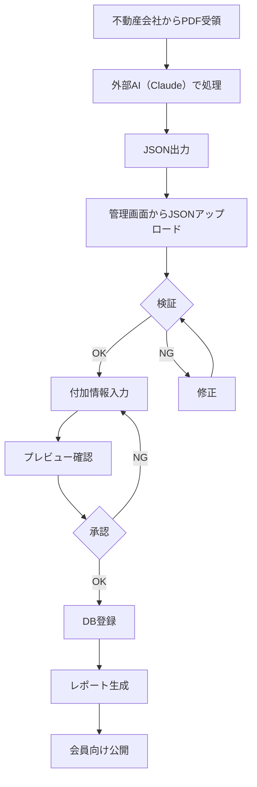

# PRISM VIP JSONデータ投入・レポート作成実装計画書

## 1. 業務フロー概要

### 1.1 全体フロー



### 1.2 処理時間目標

| 工程 | 目標時間 | 現状（手動） |
|-----|---------|-------------|
| 外部AIでPDF処理 | 3分 | - |
| JSONアップロード | 30秒 | - |
| データ検証 | 30秒 | - |
| 付加情報入力 | 5分 | 30分 |
| 承認・レビュー | 2分 | 10分 |
| DB登録・レポート生成 | 30秒 | 60分 |
| **合計** | **約11分** | **100分** |

## 2. 段階的実装計画

### Phase 1: MVP実装（1週間）

#### 基本機能
```javascript
// JSONアップロードと検証
class JSONUploadProcessor {
  async process(jsonData) {
    // 1. JSONパースと検証
    const parsed = this.parseJSON(jsonData);
    
    // 2. スキーマ検証
    const validated = this.validateSchema(parsed);
    
    // 3. 付加情報入力フォーム表示
    const enhanced = await this.showEnhancementForm(validated);
    
    // 4. レポート生成
    return this.generateReport(enhanced);
  }
}
```

対応項目:
- [ ] JSONアップロード画面
- [ ] スキーマ検証機能
- [ ] 付加情報入力フォーム
- [ ] プレビュー機能
- [ ] DB登録

#### 付加機能
- [ ] 複数JSON同時処理
- [ ] テンプレート機能
- [ ] エラーハンドリング
- [ ] 自動計算フィールド

### Phase 2: 本格実装（2週間）

#### Week 2: 管理機能強化
```javascript
// 完全なレポート作成システム
class CompleteReportSystem {
  constructor() {
    this.workflow = {
      'upload': JSONUploadHandler,
      'validate': DataValidator,
      'enhance': DataEnhancer,
      'preview': ReportPreview,
      'publish': ReportPublisher
    };
  }

  async processWorkflow(jsonData) {
    // 1. JSONデータ検証
    const validated = await this.workflow.validate(jsonData);
    
    // 2. 付加情報とマージ
    const enhanced = await this.workflow.enhance(validated);
    
    // 3. レポート生成
    const report = await this.generateFullReport(enhanced);
    
    // 4. 承認フロー
    const approved = await this.approvalFlow(report);
    
    // 5. 公開
    if (approved) {
      return await this.workflow.publish(report);
    }
  }
}
```

#### Week 3: バッチ処理・最適化
- [ ] 複数JSON一括処理
- [ ] 承認ワークフロー
- [ ] 通知機能
- [ ] パフォーマンス最適化

### Phase 3: 高度な機能（1週間）

- [ ] ステージ別情報開示管理
- [ ] レポートバージョン管理
- [ ] 会員向け通知連携
- [ ] 分析ダッシュボード

## 3. 技術実装詳細

### 3.1 フロントエンド実装

```typescript
// pages/admin/json-import.tsx
import { useState } from 'react';

export default function JSONImportPage() {
  const [jsonData, setJsonData] = useState('');
  const [validationResult, setValidationResult] = useState(null);
  const [additionalInfo, setAdditionalInfo] = useState({});

  const handleJSONUpload = async () => {
    try {
      // JSONパース
      const parsed = JSON.parse(jsonData);
      
      // サーバーで検証
      const response = await fetch('/api/json/validate', {
        method: 'POST',
        headers: { 'Content-Type': 'application/json' },
        body: JSON.stringify(parsed)
      });
      
      const result = await response.json();
      setValidationResult(result);
      
      if (result.valid) {
        // 付加情報入力フォーム表示
        showAdditionalInfoForm(parsed);
      }
    } catch (error) {
      console.error('JSONエラー:', error);
    }
  };

  const submitCompleteReport = async () => {
    const completeData = {
      ...JSON.parse(jsonData),
      prismAnalysis: additionalInfo
    };
    
    const response = await fetch('/api/reports/create', {
      method: 'POST',
      headers: { 'Content-Type': 'application/json' },
      body: JSON.stringify(completeData)
    });
    
    const result = await response.json();
    if (result.success) {
      alert('レポートが作成されました');
    }
  };

  return (
    <div className="json-import-page">
      <h2>JSONデータアップロード</h2>
      
      <textarea
        value={jsonData}
        onChange={(e) => setJsonData(e.target.value)}
        placeholder="外部AIからのJSONを貼り付け"
        rows={15}
      />
      
      <button onClick={handleJSONUpload}>検証</button>
      
      {validationResult && (
        <ValidationResults result={validationResult} />
      )}
      
      {validationResult?.valid && (
        <AdditionalInfoForm 
          onSubmit={setAdditionalInfo}
          onComplete={submitCompleteReport}
        />
      )}
    </div>
  );
}
```

### 3.2 バックエンド実装

```typescript
// app/api/json/validate/route.ts
import { NextRequest, NextResponse } from 'next/server';
import { z } from 'zod';

// JSONスキーマ定義
const PropertySchema = z.object({
  basicInfo: z.object({
    propertyName: z.string(),
    location: z.object({
      prefecture: z.string(),
      city: z.string(),
      address: z.string()
    }),
    price: z.number(),
    landArea: z.number().optional(),
    buildingArea: z.number().optional(),
    propertyType: z.string()
  }),
  incomeInfo: z.object({
    monthlyRent: z.number().optional(),
    annualIncome: z.number(),
    occupancyRate: z.number().optional()
  })
});

export async function POST(request: NextRequest) {
  try {
    const data = await request.json();
    
    // スキーマ検証
    const result = PropertySchema.safeParse(data);
    
    if (!result.success) {
      return NextResponse.json({
        valid: false,
        errors: result.error.errors
      });
    }
    
    // ビジネスルール検証
    const businessValidation = validateBusinessRules(result.data);
    
    // 自動計算
    const enhanced = addCalculatedFields(result.data);
    
    return NextResponse.json({
      valid: true,
      data: enhanced,
      warnings: businessValidation.warnings
    });
    
  } catch (error) {
    return NextResponse.json({
      valid: false,
      error: error.message
    }, { status: 500 });
  }
}

function validateBusinessRules(data: any) {
  const warnings = [];
  
  // 利回りチェック
  const yield = (data.incomeInfo.annualIncome / data.basicInfo.price) * 100;
  if (yield < 3) {
    warnings.push('利回りが3%未満です');
  }
  if (yield > 15) {
    warnings.push('利回りが異常に高いです');
  }
  
  return { warnings };
}

function addCalculatedFields(data: any) {
  return {
    ...data,
    calculations: {
      grossYield: (data.incomeInfo.annualIncome / data.basicInfo.price * 100).toFixed(2),
      monthlyIncome: Math.round(data.incomeInfo.annualIncome / 12),
      pricePerSqm: data.basicInfo.buildingArea ? 
        Math.round(data.basicInfo.price / data.basicInfo.buildingArea) : null
    }
  };
}
```

### 3.3 Supabase Edge Function実装

```typescript
// supabase/functions/pdf-processor/index.ts
import { serve } from 'https://deno.land/std@0.168.0/http/server.ts'
import { createClient } from 'https://esm.sh/@supabase/supabase-js@2'

serve(async (req) => {
  try {
    // Supabaseクライアント初期化
    const supabase = createClient(
      Deno.env.get('SUPABASE_URL')!,
      Deno.env.get('SUPABASE_SERVICE_KEY')!
    );
    
    const { pdfUrl, propertyId } = await req.json();
    
    // PDFダウンロード
    const pdfResponse = await fetch(pdfUrl);
    const pdfBuffer = await pdfResponse.arrayBuffer();
    
    // OCR処理（Google Cloud Vision）
    const ocrResult = await performOCR(pdfBuffer);
    
    // AI抽出
    const extractedData = await extractWithOpenAI(ocrResult.text);
    
    // DB保存
    const { error } = await supabase
      .from('property_extracted_data')
      .upsert({
        property_id: propertyId,
        extracted_data: extractedData,
        confidence_score: extractedData.confidence,
        status: 'pending_review'
      });
    
    if (error) throw error;
    
    return new Response(
      JSON.stringify({ success: true, data: extractedData }),
      { headers: { 'Content-Type': 'application/json' } }
    );
    
  } catch (error) {
    return new Response(
      JSON.stringify({ error: error.message }),
      { status: 500, headers: { 'Content-Type': 'application/json' } }
    );
  }
});
```

## 4. コスト試算

### 4.1 システム利用料金（月間500物件想定）

| 項目 | 内容 | 月額費用 |
|---------|------|---------|
| 外部AI処理 | Claude等でのPDF処理（別途） | - |
| Supabase | データベース・ストレージ | $25 |
| Vercel | ホスティング | $20 |
| **合計** | - | **約$45（約6,800円）** |

### 4.2 時間削減効果

| 項目 | 現状 | 導入後 | 削減時間 |
|-----|------|--------|---------|
| 1物件あたり処理時間 | 100分 | 11分 | 89分 |
| 月間処理時間（500物件） | 833時間 | 92時間 | 741時間 |
| 人件費（時給3,000円） | 250万円 | 27.6万円 | **222.4万円削減** |

**ROI: 初月で投資回収可能**

## 5. リスク対策

### 5.1 技術的リスク

| リスク | 対策 |
|-------|------|
| 外部AI出力エラー | JSONスキーマ検証、手動修正UI |
| データ不整合 | ビジネスルール検証、警告表示 |
| 承認漏れ | ワークフロー管理、通知機能 |
| 大量処理時のパフォーマンス | キュー管理、非同期処理 |

### 5.2 業務リスク

| リスク | 対策 |
|-------|------|
| 誤データ登録 | 付加情報入力必須、承認フロー |
| 機密情報漏洩 | 暗号化、アクセス制御 |
| システム障害 | JSONバックアップ、手動入力フォールバック |

## 6. KPI設定

### 6.1 品質指標

- **JSON検証成功率**: 95%以上
- **付加情報入力完了率**: 100%
- **承認通過率**: 90%以上

### 6.2 効率指標

- **処理時間**: 10分以内/物件
- **自動化率**: 80%以上
- **コスト削減**: 200万円/月以上

### 6.3 モニタリング

```javascript
// ダッシュボード表示項目
const metrics = {
  daily: {
    processedCount: 45,
    averageTime: '6.5分',
    successRate: '92%',
    manualInterventions: 3
  },
  monthly: {
    totalProcessed: 523,
    costSaved: '2,325,000円',
    accuracyTrend: '+3.2%',
    apiCost: '9,234円'
  },
  alerts: [
    { type: 'warning', message: 'OCR精度が低下しています（東京都の物件）' },
    { type: 'info', message: '本日のAPI使用量: 60%' }
  ]
};
```

## 7. 運用マニュアル

### 7.1 日次運用

1. **9:00** - 前日処理分の確認
2. **10:00-17:00** - 新規PDF処理・確認
3. **17:00** - 処理結果レポート確認

### 7.2 エラー対応

```javascript
// エラー種別と対応
const errorHandling = {
  'PDF_CORRUPTED': '再アップロード依頼',
  'OCR_FAILED': '画像品質確認→再スキャン依頼',
  'AI_EXTRACTION_FAILED': '手動入力切り替え',
  'VALIDATION_ERROR': '元データ確認→修正',
  'API_LIMIT': '翌日処理にキューイング'
};
```

### 7.3 改善サイクル

1. **週次**: エラー分析、精度確認
2. **月次**: プロンプト調整、ルール更新
3. **四半期**: システム評価、機能追加検討

## 8. 今後の拡張計画

### 短期（3ヶ月）
- 図面解析機能
- 契約書PDF対応
- モバイルアプリ対応

### 中期（6ヶ月）
- 他言語対応（英語、中国語）
- 外部システム連携（不動産ポータル）
- AI予測機能（将来価値予測）

### 長期（1年）
- 完全自動化（承認不要レベル）
- 業界標準化（API提供）
- ブロックチェーン連携（データ真正性保証）

---
*最終更新日: 2024年9月4日*